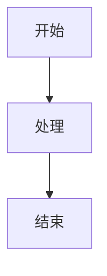
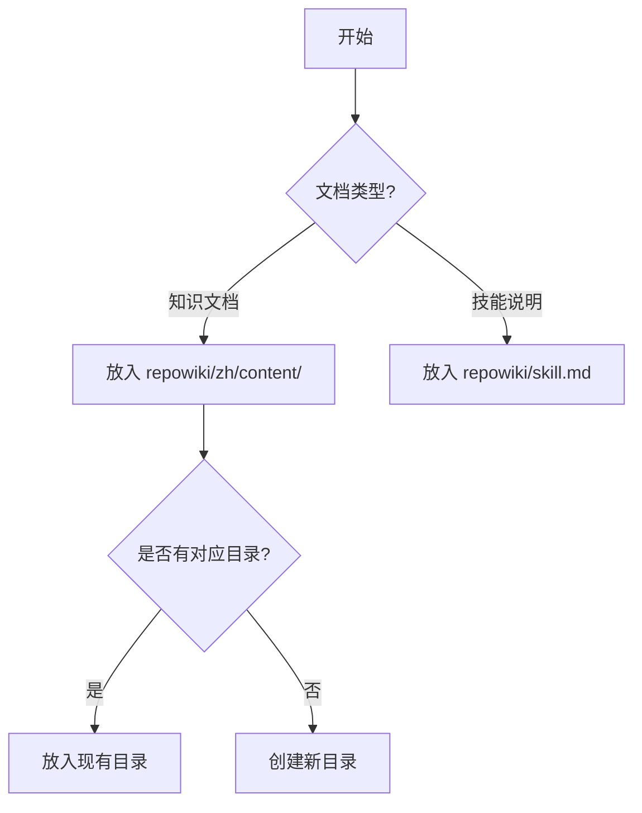
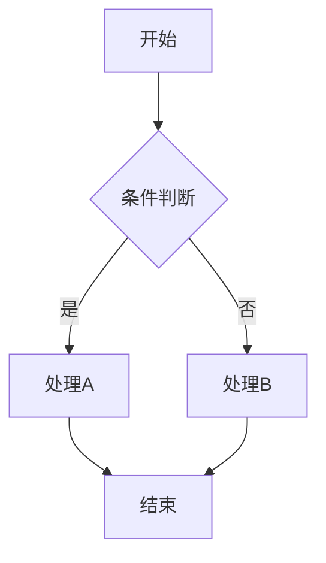
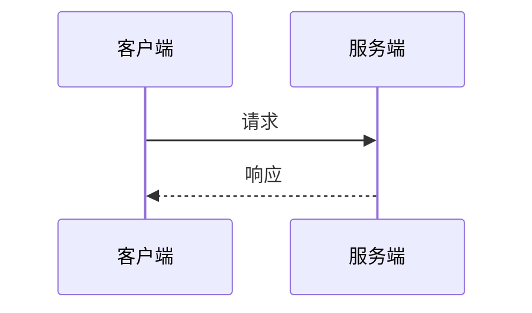
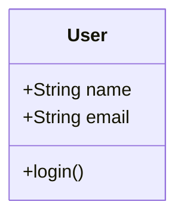
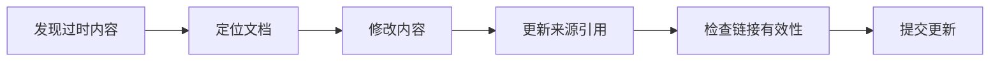

# RepoWiki 文档编写与维护指南

## 目录
1. [概述](#概述)
2. [目录结构](#目录结构)
3. [文档格式规范](#文档格式规范)
4. [创建文档流程](#创建文档流程)
5. [文档内容规范](#文档内容规范)
6. [Mermaid 图表使用](#mermaid-图表使用)
7. [文档维护](#文档维护)
8. [元数据管理](#元数据管理)
9. [最佳实践](#最佳实践)

---

## 概述

`repowiki/` 目录位于项目根目录下，是 AI 和开发者的知识库系统，用于存储项目相关的文档和技能说明。本指南说明如何正确创建、编写和维护这些文档。

---

## 目录结构

```
项目根目录/
└── repowiki/                        # 项目知识库（位于项目根目录）
    ├── skill.md                     # 技能说明（本文件）
    └── zh/                          # 中文版本
        ├── content/                 # 文档内容
        │   ├── 系统概述.md
        │   ├── 技术栈与依赖.md
        │   ├── 目录结构详解.md
        │   ├── 后端架构/            # 主题子目录
        │   │   ├── 后端架构.md
        │   │   ├── 配置管理.md
        │   │   ├── 模块化设计/
        │   │   └── 插件系统/
        │   ├── 移动端架构/
        │   ├── 核心功能模块/
        │   ├── 数据库设计/
        │   ├── API参考/
        │   ├── 安全考虑/
        │   ├── 开发指南/
        │   ├── 部署指南/
        │   └── 故障排除/
        └── meta/                    # 元数据
            └── repowiki-metadata.json
```

### 目录说明

| 目录 | 用途 | 文件类型 |
|------|------|----------|
| `repowiki/skill.md` | 技能说明文档 | Markdown |
| `repowiki/zh/content/` | 项目知识库文档 | Markdown |
| `repowiki/zh/meta/` | 知识库元数据 | JSON |

---

## 文档格式规范

### 基本结构

每个文档应包含以下部分：

```markdown
# 文档标题

<cite>
**本文档引用的文件**
- [文件名](file://相对路径)
- [文件名](file://相对路径)
</cite>

## 目录
1. [章节一](#章节一)
2. [章节二](#章节二)
3. [章节三](#章节三)

## 章节一
内容...

**Section sources**
- [文件名](file://路径#L行号-L行号)

## 章节二
内容...

**Section sources**
- [文件名](file://路径)
```

### 关键格式元素

#### 1. 文件引用（cite 标签）

文档开头使用 `<cite>` 标签声明引用的文件：

```markdown
<cite>
**本文档引用的文件**
- [env.ts](file://backend/src/config/env.ts)
- [.env.example](file://backend/.env.example)
- [index.ts](file://backend/src/index.ts)
</cite>
```

#### 2. 章节来源（Section sources）

每个章节末尾标注内容来源：

```markdown
## 配置加载机制

配置系统通过 dotenv 库加载环境变量...

**Section sources**
- [env.ts](file://backend/src/config/env.ts#L1-L50)
```

#### 3. 图表来源（Diagram sources）

Mermaid 图表后标注图表来源：

```markdown


**Diagram sources**
- [orchestrator.ts](file://backend/src/modules/assistant/orchestrator.ts#L100-L150)
```

---

## 创建文档流程

### 步骤一：确定文档位置



### 步骤二：选择文档模板

**知识文档模板**：
```markdown
# 主题名称

<cite>
**本文档引用的文件**
- [文件](file://路径)
</cite>

## 目录
1. [简介](#简介)
2. [核心概念](#核心概念)
3. [实现细节](#实现细节)
4. [使用示例](#使用示例)
5. [最佳实践](#最佳实践)

## 简介
简要介绍主题背景和目的...

**Section sources**
- [文件](file://路径)

## 核心概念
...
```

### 步骤三：编写内容

1. 填写文件引用（cite）
2. 编写目录（TOC）
3. 逐章节填写内容
4. 添加代码示例和图表
5. 标注章节来源

### 步骤四：检查与完善

- [ ] 所有引用文件路径正确
- [ ] 目录链接可跳转
- [ ] Mermaid 图表语法正确
- [ ] 每个章节有来源标注
- [ ] 代码示例可运行

---

## 文档内容规范

### 标题层级

```markdown
# 一级标题（文档标题，仅一个）
## 二级标题（主要章节）
### 三级标题（子章节）
#### 四级标题（细分内容）
```

### 代码块

指定语言以启用语法高亮：

````markdown
```typescript
const config = {
  port: 4000,
  host: '0.0.0.0'
};
```

```dart
class MyWidget extends StatelessWidget {
  @override
  Widget build(BuildContext context) {
    return Container();
  }
}
```

```sql
SELECT * FROM users WHERE status = 'active';
```
````

### 表格

```markdown
| 列1 | 列2 | 列3 |
|-----|-----|-----|
| 内容 | 内容 | 内容 |
```

### 提示框样式

```markdown
> **注意**：重要提示内容

> **警告**：警告内容

> **提示**：有用的建议
```

---

## Mermaid 图表使用

### 流程图（flowchart）

```markdown

```

### 时序图（sequence）

```markdown

```

### 类图（class）

```markdown

```

### 注意事项

1. **不使用样式定义**：避免 `style`、`classDef`、`fill` 等
2. **保持简洁**：只用基本语法
3. **中文标签**：节点文字可使用中文

---

## 文档维护

### 何时更新文档

| 场景 | 操作 |
|------|------|
| 代码重构 | 更新相关架构文档 |
| 新增功能 | 添加功能说明文档 |
| 修复 Bug | 更新故障排除文档 |
| API 变更 | 更新 API 参考文档 |
| 配置变更 | 更新配置管理文档 |

### 更新流程



### 文档版本追踪

在文档末尾添加更新记录：

```markdown
---

## 更新记录

| 日期 | 内容 | 作者 |
|------|------|------|
| 2026-01-15 | 初始版本 | - |
| 2026-01-20 | 添加配置示例 | - |
```

---

## 元数据管理

### metadata.json 结构

`repowiki-metadata.json` 存储知识库的关系和目录信息：

```json
{
  "knowledge_relations": [
    {
      "source_id": "uuid",
      "target_id": "uuid",
      "relationship_type": "PARENT_CHILD"
    }
  ],
  "wiki_catalogs": [
    {
      "id": "uuid",
      "name": "文档名称",
      "description": "描述",
      "progress_status": "completed",
      "dependent_files": "file1.ts,file2.ts"
    }
  ]
}
```

### 关系类型

- `PARENT_CHILD`：父子关系（目录层级）
- 其他自定义关系类型

---

## 最佳实践

### DO（推荐）

- ✅ 每个章节标注来源文件
- ✅ 使用 Mermaid 图表可视化复杂流程
- ✅ 提供可运行的代码示例
- ✅ 保持文档与代码同步更新
- ✅ 使用中文编写，术语可保留英文
- ✅ 文件路径使用 `file://` 协议

### DON'T（避免）

- ❌ 在图表中使用样式定义
- ❌ 创建重复的文档
- ❌ 硬编码过时的代码示例
- ❌ 省略来源引用
- ❌ 使用绝对路径

### 文档质量检查清单

- [ ] 标题清晰描述文档主题
- [ ] cite 标签包含所有引用文件
- [ ] 目录与实际章节对应
- [ ] 每个章节有 Section sources
- [ ] 代码示例有语法高亮
- [ ] Mermaid 图表可正常渲染
- [ ] 无死链接
- [ ] 内容与最新代码一致

---

## 快速参考

### 文件引用格式

```markdown
[文件名](file://相对路径)
[文件名](file://相对路径#L起始行-L结束行)
```

### 章节来源格式

```markdown
**Section sources**
- [文件名](file://路径)
```

### 图表来源格式

```markdown
**Diagram sources**
- [文件名](file://路径)
```

---

## 更新记录

| 日期 | 内容 | 作者 |
|------|------|------|
| 2026-01-15 | 初始版本，完整编写指南 | - |
