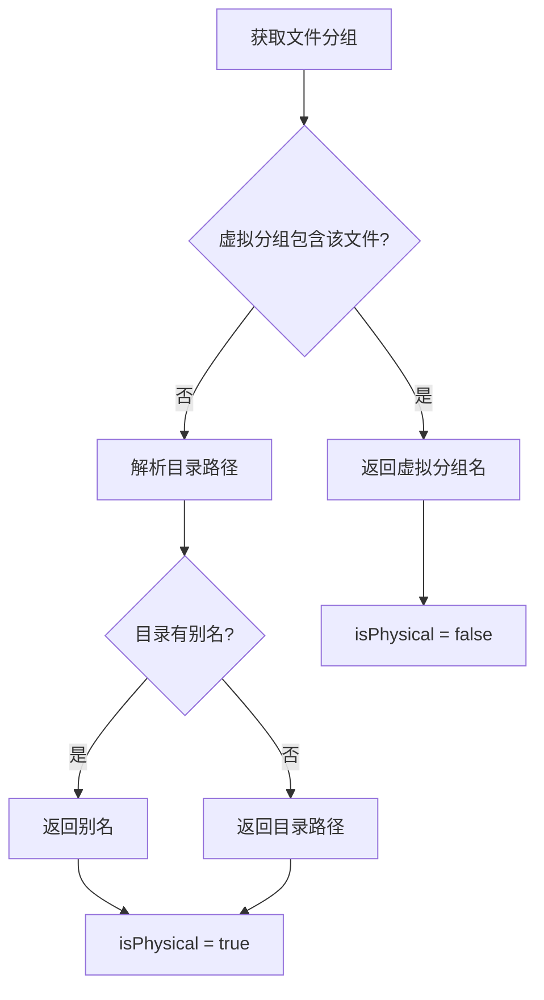

# 分组管理

<cite>
**本文档引用的文件**
- [groupManager.ts](../../../../src/groupManager.ts)
- [types.ts](../../../../src/types.ts)
</cite>

## 目录
1. [概述](#概述)
2. [核心概念](#核心概念)
3. [虚拟分组管理](#虚拟分组管理)
4. [目录别名系统](#目录别名系统)
5. [文件分组逻辑](#文件分组逻辑)
6. [API 参考](#api-参考)
7. [配置存储](#配置存储)

## 概述
`GroupManager` 负责读取与维护工作区内的分组配置，支持虚拟分组与物理分组两种组织方式，并提供目录别名与初始化状态管理。

**Section sources**
- [groupManager.ts](../../../../src/groupManager.ts#L5-L179)

## 核心概念

### 分组类型

| 类型 | 说明 | 存储方式 |
|---|---|---|
| 虚拟分组 | 用户维护的文件集合，可跨目录 | `repowiki.groups` |
| 物理分组 | 基于文件系统目录自动生成 | 目录路径映射 |

### 默认分组
`DEFAULT_GROUP` 设为“未分类”，用于兜底归类。该分组不可删除、不可重命名。

**Section sources**
- [groupManager.ts](../../../../src/groupManager.ts#L5-L9)
- [groupManager.ts](../../../../src/groupManager.ts#L88-L139)
- [types.ts](../../../../src/types.ts#L6-L13)

## 虚拟分组管理

### 创建分组

```typescript
async createGroup(name: string): Promise<boolean>
```

分组名为空或为默认分组时返回 `false`，同名分组会被拒绝。

### 删除分组

```typescript
async deleteGroup(name: string): Promise<boolean>
```

默认分组不可删除，删除成功后配置被持久化。

### 重命名分组

```typescript
async renameGroup(oldName: string, newName: string): Promise<boolean>
```

默认分组不可重命名，目标名称已存在时操作失败。

### 移动文件到分组

```typescript
async moveFileToGroup(relativePath: string, groupName: string): Promise<boolean>
```

移动时会先从所有虚拟分组中移除该文件，再加入目标分组。

**Section sources**
- [groupManager.ts](../../../../src/groupManager.ts#L88-L161)

## 目录别名系统

目录别名用于为物理目录提供更友好的显示名称，不影响真实路径。

```typescript
async setDirectoryAlias(directoryPath: string, alias: string): Promise<boolean>
```

```typescript
getDirectoryDisplayName(directoryPath: string): string
```

当目录为空字符串时，显示名称为“根目录”。

**Section sources**
- [groupManager.ts](../../../../src/groupManager.ts#L30-L42)

## 文件分组逻辑

`getFileGroup` 优先检查虚拟分组，未命中时回退到物理目录分组，并应用目录别名。



**Diagram sources**
- [groupManager.ts](../../../../src/groupManager.ts#L57-L70)

`getPhysicalGroups` 从文件列表中提取唯一目录并映射到显示名称。

**Section sources**
- [groupManager.ts](../../../../src/groupManager.ts#L57-L86)

## API 参考

| 方法 | 返回类型 | 说明 |
|---|---|---|
| `getGroups()` | `GroupConfig` | 获取虚拟分组配置 |
| `getDirectoryAliases()` | `DirectoryAliasConfig` | 获取目录别名配置 |
| `getAllVirtualGroupNames()` | `string[]` | 返回所有虚拟分组名 |
| `isInitialized()` | `boolean` | 检查初始化状态 |
| `markInitialized()` | `Promise<void>` | 标记初始化完成 |

**Section sources**
- [groupManager.ts](../../../../src/groupManager.ts#L18-L172)

## 配置存储

所有配置保存于工作区级别的 `repowiki` 配置段：

| 键 | 类型 | 说明 |
|---|---|---|
| `repowiki.groups` | `GroupConfig` | 虚拟分组配置 |
| `repowiki.directoryAliases` | `DirectoryAliasConfig` | 目录别名配置 |
| `repowiki.initialized` | `boolean` | 初始化标记 |

**Section sources**
- [groupManager.ts](../../../../src/groupManager.ts#L5-L54)
- [groupManager.ts](../../../../src/groupManager.ts#L169-L172)
