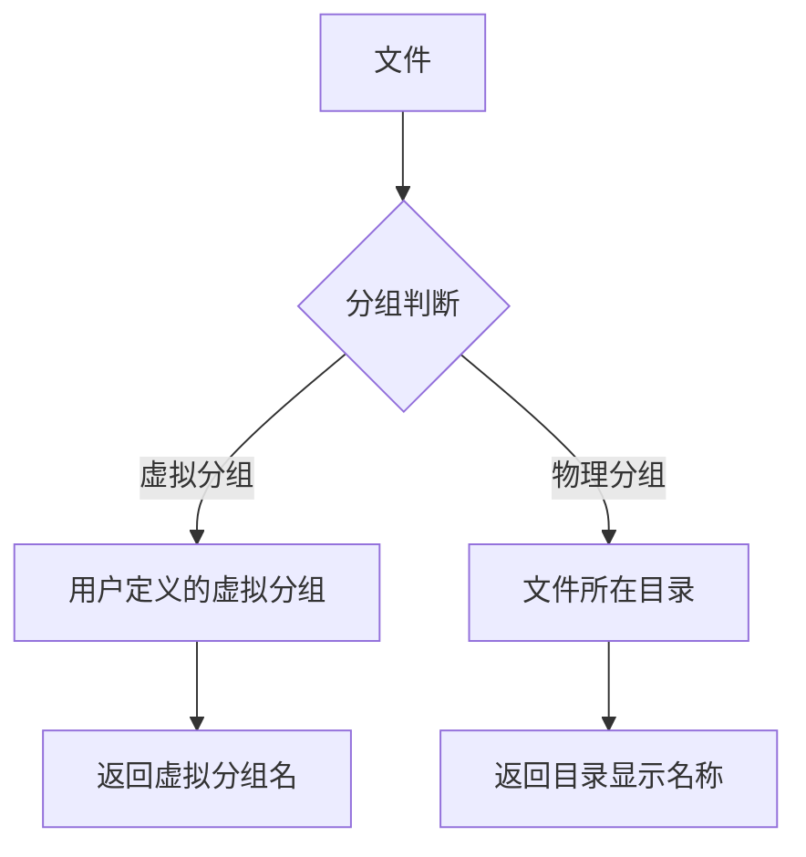
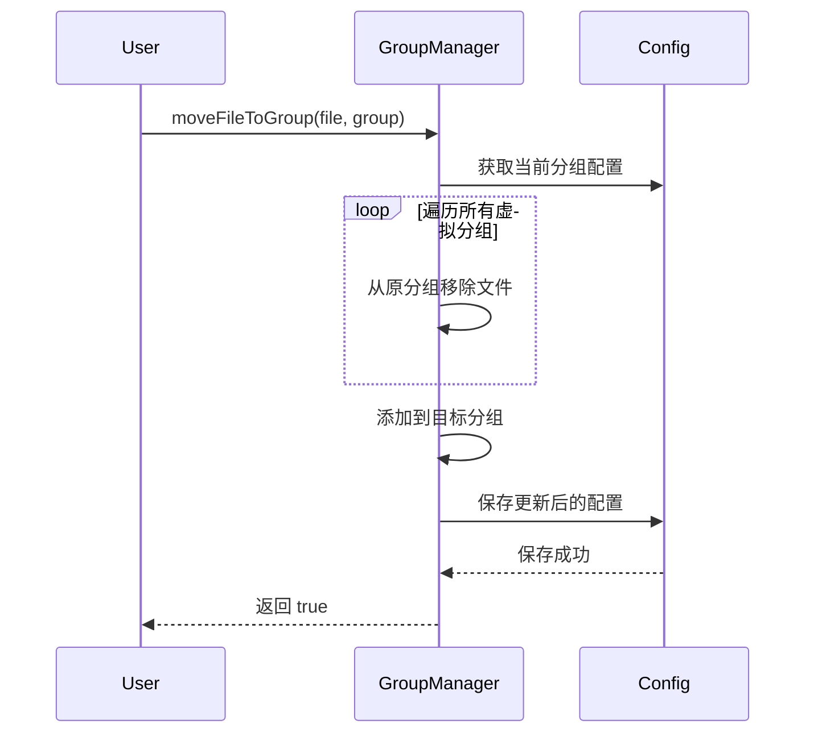

```markdown
# 分组管理

<cite>源代码文件：[src/groupManager.ts](../src/groupManager.ts)</cite>

## 目录

- [概述](#概述)
- [架构设计](#架构设计)
- [核心功能](#核心功能)
- [配置管理](#配置管理)
- [API 参考](#api-参考)

## 概述

`GroupManager` 类负责管理 VSCode Wiki 扩展中的文件分组功能，支持虚拟分组和物理分组两种模式。虚拟分组允许用户将来自不同目录的文件组织在同一个逻辑分组中，而物理分组则基于文件的实际目录结构。

**Section sources:** [src/groupManager.ts:1-23](../src/groupManager.ts#L1-L23)

## 架构设计

### 分组类型



### 配置结构

分组配置存储在 VSCode 工作区设置中，使用 `repowiki.*` 命名空间：

- `repowiki.groups` - 虚拟分组配置
- `repowiki.directoryAliases` - 目录别名配置
- `repowiki.initialized` - 初始化状态标记

**Section sources:** [src/groupManager.ts:7-12](../src/groupManager.ts#L7-L12)

## 核心功能

### 获取文件分组

`getFileGroup` 方法实现智能分组判断逻辑，优先返回虚拟分组，未找到时返回物理分组：

```typescript
/** 获取文件所属分组（优先虚拟分组，再物理目录） */
getFileGroup(relativePath: string): { groupName: string; isPhysical: boolean } {
  // 先查虚拟分组
  const groups = this.getGroups();
  for (const [groupName, files] of Object.entries(groups)) {
    if (files.includes(relativePath)) {
      return { groupName, isPhysical: false };
    }
  }

  // 返回物理分组（目录）
  const directory = path.dirname(relativePath);
  const displayName = this.getDirectoryDisplayName(directory);
  return { groupName: displayName, isPhysical: true };
}
```

**Section sources:** [src/groupManager.ts:59-75](../src/groupManager.ts#L59-L75)

### 虚拟分组管理

#### 创建分组

```typescript
async createGroup(name: string): Promise<boolean>
```

- 验证分组名有效性（不能为空或与默认分组同名）
- 检查分组是否已存在
- 创建空分组并保存配置

**Section sources:** [src/groupManager.ts:93-107](../src/groupManager.ts#L93-L107)

#### 删除分组

```typescript
async deleteGroup(name: string): Promise<boolean>
```

- 禁止删除默认分组 "未分类"
- 删除后文件自动归属到物理分组

**Section sources:** [src/groupManager.ts:109-121](../src/groupManager.ts#L109-L121)

#### 重命名分组

```typescript
async renameGroup(oldName: string, newName: string): Promise<boolean>
```

- 保持分组内的文件列表不变
- 禁止使用默认分组名作为新名称

**Section sources:** [src/groupManager.ts:123-135](../src/groupManager.ts#L123-L135)

### 文件移动



```typescript
async moveFileToGroup(relativePath: string, groupName: string): Promise<boolean> {
  const groups = this.getGroups();

  // 从所有虚拟分组中移除该文件
  for (const files of Object.values(groups)) {
    const idx = files.indexOf(relativePath);
    if (idx !== -1) {
      files.splice(idx, 1);
    }
  }

  // 添加到目标虚拟分组
  if (!groups[groupName]) {
    groups[groupName] = [];
  }
  groups[groupName].push(relativePath);

  await this.saveGroups(groups);
  return true;
}
```

**Section sources:** [src/groupManager.ts:137-155](../src/groupManager.ts#L137-L155)

## 配置管理

### 目录别名

目录别名功能允许为物理目录设置友好的显示名称：

```typescript
// 设置目录别名
async setDirectoryAlias(directoryPath: string, alias: string): Promise<boolean>

// 获取目录显示名称
getDirectoryDisplayName(directoryPath: string): string
```

**Section sources:** [src/groupManager.ts:24-35](../src/groupManager.ts#L24-L35)

### 物理分组提取

从文件列表中自动提取所有物理目录：

```typescript
async getPhysicalGroups(files: Array<{ relativePath: string }>): Promise<Map<string, string>>
```

返回值为 `Map<目录路径, 显示名称>`，便于在 UI 中展示目录树。

**Section sources:** [src/groupManager.ts:77-91](../src/groupManager.ts#L77-L91)

## API 参考

### 类初始化

| 方法 | 说明 |
|------|------|
| `constructor(context: vscode.ExtensionContext)` | 创建 GroupManager 实例 |

### 分组查询

| 方法 | 返回类型 | 说明 |
|------|----------|------|
| [`getGroups()`](../src/groupManager.ts#L18-L21) | `GroupConfig` | 获取所有虚拟分组配置 |
| [`getFileGroup(relativePath)`](../src/groupManager.ts#L59-L75) | `{ groupName: string; isPhysical: boolean }` | 获取文件所属分组 |
| [`getPhysicalGroups(files)`](../src/groupManager.ts#L77-L91) | `Promise<Map<string, string>>` | 获取所有物理分组 |
| [`getAllVirtualGroupNames()`](../src/groupManager.ts#L157-L159) | `string[]` | 获取所有虚拟分组名 |

### 分组操作

| 方法 | 返回类型 | 说明 |
|------|----------|------|
| [`createGroup(name)`](../src/groupManager.ts#L93-L107) | `Promise<boolean>` | 创建新虚拟分组 |
| [`deleteGroup(name)`](../src/groupManager.ts#L109-L121) | `Promise<boolean>` | 删除虚拟分组 |
| [`renameGroup(oldName, newName)`](../src/groupManager.ts#L123-L135) | `Promise<boolean>` | 重命名虚拟分组 |
| [`moveFileToGroup(relativePath, groupName)`](../src/groupManager.ts#L137-L155) | `Promise<boolean>` | 移动文件到虚拟分组 |

### 目录别名

| 方法 | 返回类型 | 说明 |
|------|----------|------|
| [`getDirectoryAliases()`](../src/groupManager.ts#L23-L26) | `DirectoryAliasConfig` | 获取目录别名配置 |
| [`setDirectoryAlias(directoryPath, alias)`](../src/groupManager.ts#L28-L35) | `Promise<boolean>` | 设置目录别名 |
| [`getDirectoryDisplayName(directoryPath)`](../src/groupManager.ts#L37-L40) | `string` | 获取目录显示名称 |

### 初始化状态

| 方法 | 返回类型 | 说明 |
|------|----------|------|
| [`isInitialized()`](../src/groupManager.ts#L42-L45) | `boolean` | 检查是否已初始化 |
| [`markInitialized()`](../src/groupManager.ts#L47-L50) | `Promise<void>` | 标记为已初始化 |

### 静态属性

| 属性 | 类型 | 说明 |
|------|------|------|
| [`DEFAULT_GROUP`](../src/groupManager.ts#L164-L166) | `string` | 默认分组名称 "未分类" |

**Section sources:** [src/groupManager.ts:13-166](../src/groupManager.ts#L13-L166)
```