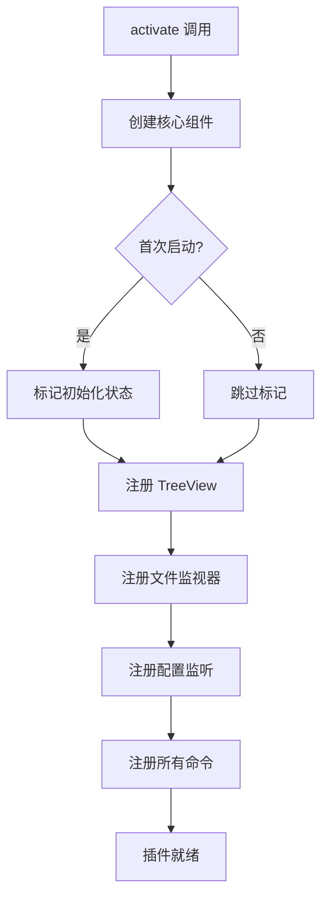

```markdown
# 插件入口与命令

> <cite>源文件：`file://src/extension.ts`</cite>

本文档描述 RepoWiki 插件的激活入口、初始化流程以及所有注册命令的详细说明。

## 目录

- [插件激活](#插件激活)
- [初始化流程](#初始化流程)
- [核心命令](#核心命令)
  - [视图操作命令](#视图操作命令)
  - [虚拟分组管理](#虚拟分组管理)
  - [AI Agent 管理](#ai-agent-管理)
  - [文档生成命令](#文档生成命令)

## 插件激活

插件通过 `activate()` 函数在 VS Code 启动时被调用，这是整个插件的入口点。

### 核心组件初始化

```typescript
export function activate(context: vscode.ExtensionContext)
```

激活过程中初始化以下核心组件：

| 组件 | 类型 | 说明 |
|------|------|------|
| `MarkdownTreeProvider` | 树形数据提供者 | 管理侧边栏树视图的数据结构 |
| `FileWatcher` | 文件监视器 | 监听文件系统变化并触发视图刷新 |
| `GroupManager` | 分组管理器 | 管理虚拟分组和物理分组 |
| `AgentManager` | AI 管理器 | 管理可用的 AI Agent 服务 |
| `DocGenerator` | 文档生成器 | 负责自动化文档生成 |

**Section sources:** `src/extension.ts:5-20`

## 初始化流程

插件启动时遵循以下初始化流程：



### TreeView 注册

```typescript
const treeView = vscode.window.createTreeView('repowiki.markdownExplorer', {
  treeDataProvider: treeProvider,
  showCollapseAll: true,
});
```

视图 ID 为 `repowiki.markdownExplorer`，支持全折叠展示。

**Section sources:** `src/extension.ts:22-30`

## 核心命令

所有命令均通过 `vscode.commands.registerCommand()` 注册到 VS Code 命令系统中。

### 视图操作命令

#### 刷新视图

```typescript
vscode.commands.registerCommand('repowiki.refresh', () => {
  treeProvider.refresh();
})
```

- **命令 ID**: `repowiki.refresh`
- **功能**: 手动刷新侧边栏树视图
- **参数**: 无

**Section sources:** `src/extension.ts:40-45`

#### 打开文件

```typescript
vscode.commands.registerCommand('repowiki.openFile', async (filePath: string) => {
  if (!filePath) return;
  const doc = await vscode.workspace.openTextDocument(filePath);
  await vscode.window.showTextDocument(doc);
})
```

- **命令 ID**: `repowiki.openFile`
- **功能**: 在编辑器中打开指定 Markdown 文件
- **参数**: `filePath` - 文件的绝对路径
- **错误处理**: 打开失败时显示错误消息

**Section sources:** `src/extension.ts:47-57`

### 虚拟分组管理

#### 创建虚拟分组

```typescript
vscode.commands.registerCommand('repowiki.createGroup', async () => {
  const name = await vscode.window.showInputBox({
    prompt: '输入新虚拟分组名称',
    placeHolder: '虚拟分组名称',
    validateInput: (value) => {
      if (!value?.trim()) return '虚拟分组名称不能为空';
      if (value === GroupManager.DEFAULT_GROUP) return '不能使用默认分组名';
      return null;
    },
  });
  if (name) {
    await groupManager.createGroup(name.trim());
    treeProvider.refresh();
  }
})
```

- **命令 ID**: `repowiki.createGroup`
- **功能**: 创建新的虚拟分组
- **输入验证**: 
  - 名称不能为空
  - 不能使用默认分组名

**Section sources:** `src/extension.ts:59-82`

#### 删除虚拟分组

```typescript
vscode.commands.registerCommand('repowiki.deleteGroup', async (node: TreeNodeData) => {
  if (node?.isPhysical) {
    vscode.window.showWarningMessage('物理目录分组不可删除，只能设置别名');
    return;
  }
  const confirm = await vscode.window.showWarningMessage(
    `确定删除虚拟分组 "${node.groupName}"？该分组下的文件将回到物理目录分组。`,
    '确定',
    '取消'
  );
  if (confirm === '确定') {
    await groupManager.deleteGroup(node.groupName);
    treeProvider.refresh();
  }
})
```

- **命令 ID**: `repowiki.deleteGroup`
- **功能**: 删除虚拟分组
- **约束**: 物理目录分组不可删除
- **参数**: `node` - 树节点数据
- **确认**: 删除前需要用户确认

**Section sources:** `src/extension.ts:84-108`

#### 重命名虚拟分组

```typescript
vscode.commands.registerCommand('repowiki.renameGroup', async (node: TreeNodeData) => {
  if (node?.isPhysical) {
    vscode.window.showWarningMessage('物理目录分组不可重命名，请使用"设置别名"功能');
    return;
  }
  const newName = await vscode.window.showInputBox({
    prompt: '输入新的虚拟分组名称',
    value: node.groupName,
    validateInput: (value) => {
      if (!value?.trim()) return '虚拟分组名称不能为空';
      if (value === GroupManager.DEFAULT_GROUP) return '不能使用默认分组名';
      return null;
    },
  });
  if (newName && newName !== node.groupName) {
    await groupManager.renameGroup(node.groupName, newName.trim());
    treeProvider.refresh();
  }
})
```

- **命令 ID**: `repowiki.renameGroup`
- **功能**: 重命名虚拟分组
- **约束**: 物理目录分组不可重命名
- **参数**: `node` - 树节点数据

**Section sources:** `src/extension.ts:110-138`

#### 移动文件到虚拟分组

```typescript
vscode.commands.registerCommand('repowiki.moveToGroup', async (node: TreeNodeData) => {
  const virtualGroups = groupManager.getAllVirtualGroupNames();
  if (virtualGroups.length === 0) {
    const create = await vscode.window.showInformationMessage(
      '还没有虚拟分组，是否创建一个？',
      '创建',
      '取消'
    );
    if (create === '创建') {
      await vscode.commands.executeCommand('repowiki.createGroup');
    }
    return;
  }
  const selected = await vscode.window.showQuickPick(virtualGroups, {
    placeHolder: '选择目标虚拟分组',
  });
  if (selected) {
    await groupManager.moveFileToGroup(node.relativePath, selected);
    treeProvider.refresh();
  }
})
```

- **命令 ID**: `repowiki.moveToGroup`
- **功能**: 将文件移动到指定的虚拟分组
- **参数**: `node` - 树节点数据
- **特殊处理**: 若无虚拟分组则引导用户创建

**Section sources:** `src/extension.ts:140-170`

#### 设置目录别名

```typescript
vscode.commands.registerCommand('repowiki.setAlias', async (node: TreeNodeData) => {
  const alias = await vscode.window.showInputBox({
    prompt: '输入目录别名',
    value: node.label,
    placeHolder: '别名（留空则清除别名）',
  });
  if (alias !== undefined) {
    await groupManager.setDirectoryAlias(node.directoryPath, alias.trim());
    treeProvider.refresh();
  }
})
```

- **命令 ID**: `repowiki.setAlias`
- **功能**: 为物理目录设置显示别名
- **参数**: `node` - 树节点数据
- **说明**: 输入为空时清除已有别名

**Section sources:** `src/extension.ts:172-187`

### AI Agent 管理

#### 检测 AI Agent

```typescript
vscode.commands.registerCommand('repowiki.detectAgents', async () => {
  await vscode.window.withProgress({
    location: vscode.ProgressLocation.Notification,
    title: '检测可用的 AI Agent',
    cancellable: false,
  }, async () => {
    const configs = await agentManager.detectAvailableAgents();
    const available = configs.filter((c) => c.available);
    if (available.length === 0) {
      vscode.window.showErrorMessage('未检测到任何可用的 AI Agent');
    } else {
      await agentManager.selectBestAgent();
      vscode.window.showInformationMessage(
        `检测到 ${available.length} 个可用的 AI Agent，当前使用: ${agentManager.getActiveAgent()?.name}`
      );
    }
  });
})
```

- **命令 ID**: `repowiki.detectAgents`
- **功能**: 扫描系统中可用的 AI Agent（Qoder、Claude 等）
- **自动选择**: 检测完成后自动选择最佳 Agent

**Section sources:** `src/extension.ts:189-217`

#### 切换 AI Agent

```typescript
vscode.commands.registerCommand('repowiki.switchAgent', async () => {
  const agents = agentManager.getAvailableAgents();
  if (agents.length === 0) {
    const detect = await vscode.window.showInformationMessage(
      '还未检测 AI Agent，是否立即检测？',
      '检测',
      '取消'
    );
    if (detect === '检测') {
      await vscode.commands.executeCommand('repowiki.detectAgents');
    }
    return;
  }
  const items = agents.map((agent) => ({
    label: agent.name,
    description: agent === agentManager.getActiveAgent() ? '当前使用' : '',
    agent,
  }));
  const selected = await vscode.window.showQuickPick(items, {
    placeHolder: '选择要使用的 AI Agent',
  });
  if (selected) {
    const type = agentManager['getProviderType'](selected.agent);
    agentManager.setActiveAgent(type);
  }
})
```

- **命令 ID**: `repowiki.switchAgent`
- **功能**: 在多个可用 Agent 之间切换
- **UI**: 使用快速选择面板显示所有可用 Agent

**Section sources:** `src/extension.ts:219-251`

### 文档生成命令

#### 初始化文档库

```typescript
vscode.commands.registerCommand('repowiki.initDocs', async () => {
  // 自动检测并选择 Agent
  if (!agentManager.getActiveAgent()) {
    await agentManager.detectAvailableAgents();
    await agentManager.selectBestAgent();
  }
  
  const confirm = await vscode.window.showWarningMessage(
    `将使用 ${agentManager.getActiveAgent()?.name} 初始化文档库并生成所有文档`,
    '继续',
    '取消'
  );
  
  if (confirm === '继续') {
    await vscode.window.withProgress({
      location: vscode.ProgressLocation.Notification,
      title: '初始化文档库',
      cancellable: false,
    }, async (progress) => {
      const result = await docGenerator.initializeDocs(progress);
      // 显示结果...
    });
  }
})
```

- **命令 ID**: `repowiki.initDocs`
- **功能**: 初始化整个文档库并生成所有模块文档
- **前置条件**: 需要至少一个可用的 AI Agent
- **确认**: 执行前需要用户确认（可能耗时较长）
- **输出**: 返回成功和失败的文档数量

**Section sources:** `src/extension.ts:253-298`

#### 更新文档

```typescript
vscode.commands.registerCommand('repowiki.updateDocs', async () => {
  if (!agentManager.getActiveAgent()) {
    await agentManager.detectAvailableAgents();
    await agentManager.selectBestAgent();
  }
  // 执行文档更新...
})
```

- **命令 ID**: `repowiki.updateDocs`
- **功能**: 增量更新已有文档
- **前置条件**: 需要至少一个可用的 AI Agent

**Section sources:** `src/extension.ts:300-320`

## 命令汇总表

| 命令 ID | 功能分类 | 说明 |
|---------|----------|------|
| `repowiki.refresh` | 视图操作 | 刷新树视图 |
| `repowiki.openFile` | 视图操作 | 打开 Markdown 文件 |
| `repowiki.createGroup` | 分组管理 | 创建虚拟分组 |
| `repowiki.deleteGroup` | 分组管理 | 删除虚拟分组 |
| `repowiki.renameGroup` | 分组管理 | 重命名虚拟分组 |
| `repowiki.moveToGroup` | 分组管理 | 移动文件到虚拟分组 |
| `repowiki.setAlias` | 分组管理 | 设置目录别名 |
| `repowiki.detectAgents` | AI 管理 | 检测可用 AI Agent |
| `repowiki.switchAgent` | AI 管理 | 切换 AI Agent |
| `repowiki.initDocs` | 文档生成 | 初始化文档库 |
| `repowiki.updateDocs` | 文档生成 | 更新文档 |

**Section sources:** `src/extension.ts:40-320`
```