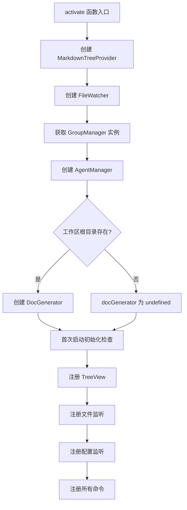
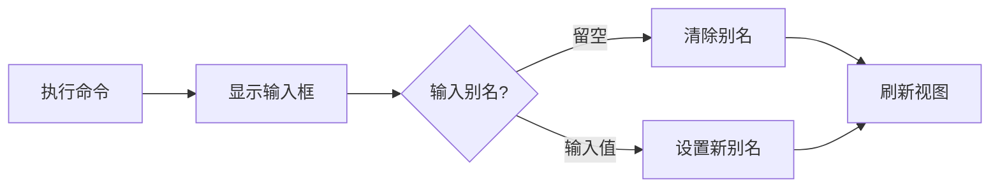
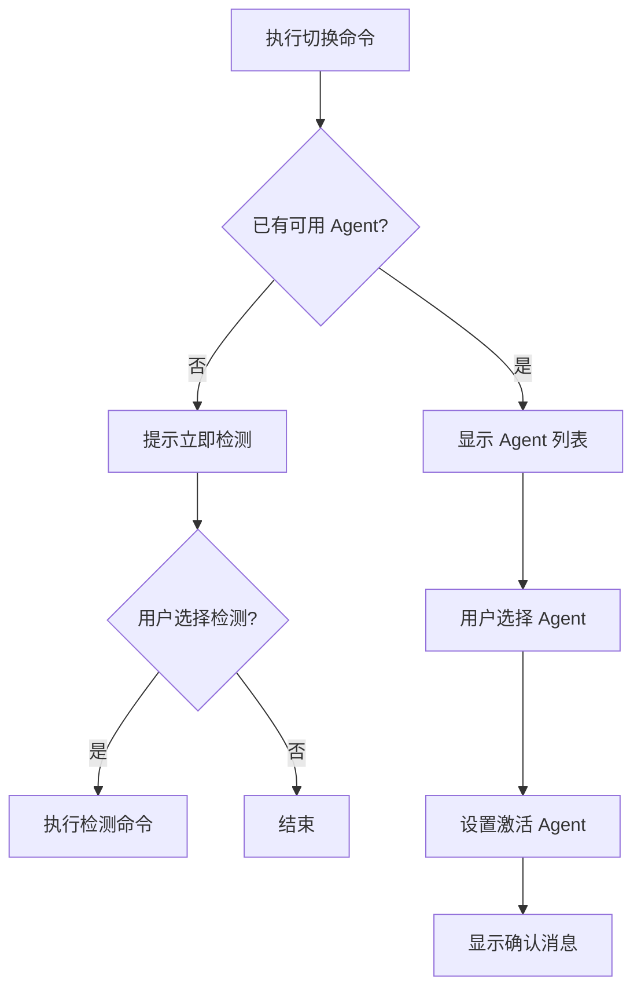
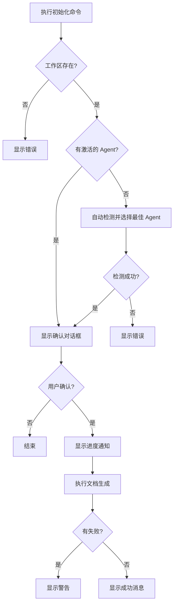

```markdown
# 插件入口与命令

<cite>源代码：src/extension.ts</cite>

## 目录

- [概述](#概述)
- [激活流程](#激活流程)
- [核心命令](#核心命令)
- [分组管理命令](#分组管理命令)
- [AI Agent 命令](#ai-agent-命令)
- [文档生成命令](#文档生成命令)

## 概述

`extension.ts` 是 VSCode Wiki 插件的入口文件，负责插件的激活、组件初始化和命令注册。插件采用 VSCode Extension API 构建，通过 `activate` 函数完成所有初始化工作。

**Section sources:** [src/extension.ts](../src/extension.ts#L1-L20)

## 激活流程

插件激活时按以下顺序完成初始化：



**Section sources:** [src/extension.ts](../src/extension.ts#L10-L47)

## 核心命令

### 视图刷新

- **命令标识符**: `repowiki.refresh`
- **功能**: 刷新 Markdown 树视图
- **实现**: 直接调用 `treeProvider.refresh()`

**Section sources:** [src/extension.ts](../src/extension.ts#L60-L65)

### 打开文件

- **命令标识符**: `repowiki.openFile`
- **参数**: `filePath: string`
- **功能**: 在编辑器中打开指定文件

```typescript
vscode.commands.registerCommand('repowiki.openFile', async (filePath: string) => {
  const doc = await vscode.workspace.openTextDocument(filePath);
  await vscode.window.showTextDocument(doc);
});
```

**Section sources:** [src/extension.ts](../src/extension.ts#L67-L79)

## 分组管理命令

### 删除虚拟分组

- **命令标识符**: `repowiki.deleteGroup`
- **参数**: `node: TreeNodeData`
- **功能**: 删除虚拟分组，文件回到物理目录分组
- **限制**: 物理分组不可删除

**Section sources:** [src/extension.ts](../src/extension.ts#L81-L102)

### 重命名虚拟分组

- **命令标识符**: `repowiki.renameGroup`
- **参数**: `node: TreeNodeData`
- **功能**: 重命名虚拟分组
- **限制**: 物理分组不可重命名（应使用别名功能）

**Section sources:** [src/extension.ts](../src/extension.ts#L104-L137)

### 设置目录别名

- **命令标识符**: `repowiki.setAlias`
- **参数**: `node: TreeNodeData`
- **功能**: 为物理目录设置显示别名



**Section sources:** [src/extension.ts](../src/extension.ts#L139-L154)

## AI Agent 命令

### 检测 AI Agent

- **命令标识符**: `repowiki.detectAgents`
- **功能**: 自动检测系统中可用的 AI Agent
- **支持类型**: Qoder、Claude、其他兼容工具

**Section sources:** [src/extension.ts](../src/extension.ts#L156-L182)

### 切换 AI Agent

- **命令标识符**: `repowiki.switchAgent`
- **功能**: 在多个可用 Agent 之间切换
- **交互**: 使用 QuickPick 界面选择



**Section sources:** [src/extension.ts](../src/extension.ts#L184-L217)

## 文档生成命令

### 初始化文档库

- **命令标识符**: `repowiki.initDocs`
- **功能**: 首次初始化文档库，生成所有文档
- **前置条件**: 需要可用的 AI Agent



**Section sources:** [src/extension.ts](../src/extension.ts#L219-L267)

### 更新文档

- **命令标识符**: `repowiki.updateDocs`
- **功能**: 增量更新已有文档
- **特点**: 仅更新有变化的文件

**Section sources:** [src/extension.ts](../src/extension.ts#L269-L315)

### 强制重新生成

- **命令标识符**: `repowiki.regenerateDocs`
- **功能**: 删除所有现有文档并重新生成
- **警告**: 此操作不可撤销

**Section sources:** [src/extension.ts](../src/extension.ts#L317-L363)
```