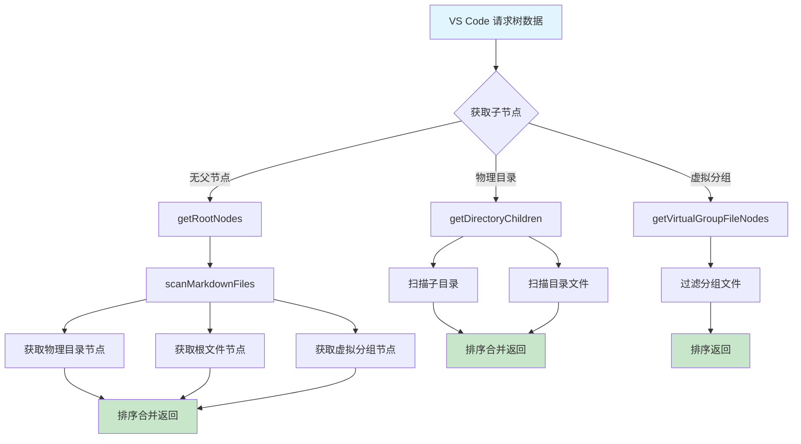

```markdown
# 树视图与分组

> 本文档说明 VSCode Wiki 扩展的树视图实现机制，包括物理目录树、虚拟分组和文件展示。

<div class="toc">

- [目录](#目录)
- [概述](#概述)
- [核心类](#核心类)
- [树节点类型](#树节点类型)
- [树视图流程](#树视图流程)
- [节点渲染](#节点渲染)
- [数据获取](#数据获取)
- [虚拟分组](#虚拟分组)
- [文件扫描](#文件扫描)

</div>

## 概述

`MarkdownTreeProvider` 是扩展的树视图数据提供者，负责在侧边栏中展示 Markdown 文件的层次结构。它支持两种组织方式：

- **物理目录**：基于文件系统实际目录结构
- **虚拟分组**：用户自定义的逻辑分组，不依赖物理目录

## 核心类

```typescript
export class MarkdownTreeProvider implements vscode.TreeDataProvider<TreeNodeData>
```

继承自 VS Code 的 `TreeDataProvider` 接口，位于 [`../src/markdownTreeProvider.ts`](../src/markdownTreeProvider.ts:4)。

### 事件

| 属性 | 类型 | 说明 |
|------|------|------|
| `_onDidChangeTreeData` | `EventEmitter` | 树数据变更事件发射器 |
| `onDidChangeTreeData` | `Event` | 树数据变更事件 |

### 依赖

- `groupManager: GroupManager` - 分组管理器，处理虚拟分组和目录显示名称

## 树节点类型

树节点使用 `TreeNodeData` 类型定义，支持两种节点类型：

```typescript
// 分组节点
{
  type: 'group',
  label: string,           // 显示名称
  groupName?: string,      // 虚拟分组名称
  isPhysical: boolean,     // 是否为物理目录
  directoryPath?: string,  // 目录路径
}

// 文件节点
{
  type: 'file',
  label: string,           // 文件名
  filePath: string,        // 绝对路径
  relativePath: string,    // 相对路径
}
```

## 树视图流程



## 节点渲染

### getTreeItem

[`getTreeItem`](../src/markdownTreeProvider.ts:30) 方法负责将 `TreeNodeData` 转换为 VS Code 的 `TreeItem`。

**分组节点：**

```typescript
const item = new vscode.TreeItem(
  element.label,
  vscode.TreeItemCollapsibleState.Collapsed  // 可折叠状态
);
item.contextValue = element.isPhysical ? 'physicalGroup' : 'virtualGroup';
item.iconPath = new vscode.ThemeIcon(element.isPhysical ? 'folder' : 'folder-library');
item.tooltip = element.isPhysical
  ? `物理目录: ${element.directoryPath || ''}`
  : '虚拟分组';
```

**文件节点：**

```typescript
const item = new vscode.TreeItem(element.label, vscode.TreeItemCollapsibleState.None);
item.contextValue = 'file';
item.iconPath = new vscode.ThemeIcon('markdown');
item.tooltip = element.relativePath;
item.command = {
  command: 'repowiki.openFile',  // 点击时执行命令
  title: '打开文件',
  arguments: [element.filePath],
};
```

### 图标说明

| 节点类型 | 图标 | 说明 |
|----------|------|------|
| 物理目录 | `folder` | 标准文件夹图标 |
| 虚拟分组 | `folder-library` | 库文件夹图标 |
| 文件 | `markdown` | Markdown 文件图标 |

## 数据获取

### getChildren

[`getChildren`](../src/markdownTreeProvider.ts:55) 方法根据父节点类型返回子节点：

```typescript
async getChildren(element?: TreeNodeData): Promise<TreeNodeData[]> {
  if (!vscode.workspace.workspaceFolders?.length) {
    return [];
  }

  // 根节点：返回目录树根节点
  if (!element) {
    return this.getRootNodes();
  }

  if (element.type !== 'group') {
    return [];
  }

  if (element.isPhysical) {
    return this.getDirectoryChildren(element.directoryPath || '');
  }

  if (element.groupName) {
    return this.getVirtualGroupFileNodes(element.groupName);
  }

  return [];
}
```

### 根节点

[`getRootNodes`](../src/markdownTreeProvider.ts:80) 返回根级别的所有节点：

1. 扫描所有 Markdown 文件
2. 构建物理目录节点
3. 构建根级文件节点
4. 构建虚拟分组节点

### 目录子节点

[`getDirectoryChildren`](../src/markdownTreeProvider.ts:107) 返回指定目录下的子节点：

1. 获取直接子目录
2. 获取目录内的文件
3. 按名称排序后返回

### 虚拟分组文件

[`getVirtualGroupFileNodes`](../src/markdownTreeProvider.ts:122) 返回虚拟分组中的文件：

```typescript
private async getVirtualGroupFileNodes(groupName: string): Promise<TreeNodeData[]> {
  const files = await this.scanMarkdownFiles();
  return files
    .filter((f) => !f.isPhysical && f.groupName === groupName)
    .map((f) => this.buildFileNode(f))
    .sort((a, b) => a.label.localeCompare(b.label));
}
```

## 虚拟分组

虚拟分组通过 [`GroupManager`](../src/groupManager.ts) 管理：

- 获取所有虚拟分组名称：`groupManager.getAllVirtualGroupNames()`
- 获取文件所属分组：`groupManager.getFileGroup(relativePath)`
- 获取目录显示名称：`groupManager.getDirectoryDisplayName(directoryPath)`

虚拟分组节点与物理目录节点的区别：

| 特性 | 物理目录 | 虚拟分组 |
|------|----------|----------|
| `isPhysical` | `true` | `false` |
| 图标 | `folder` | `folder-library` |
| 数据来源 | 文件系统结构 | 用户配置 |
| 文件归属 | 自动根据路径 | 用户手动分配 |

## 文件扫描

### scanMarkdownFiles

[`scanMarkdownFiles`](../src/markdownTreeProvider.ts:178) 扫描工作区所有 Markdown 文件：


**排除模式配置：**

从 `repowiki.excludePatterns` 配置中读取排除模式，支持 glob 语法。

**返回数据结构：**

```typescript
interface MarkdownFileInfo {
  name: string;          // 文件名
  absolutePath: string;   // 绝对路径
  relativePath: string;   // 相对工作区路径
  groupName?: string;     // 所属虚拟分组
  directory: string;      // 所属目录
  isPhysical: boolean;    // 是否为物理文件
}
```

### 刷新树视图

调用 [`refresh()`](../src/markdownTreeProvider.ts:16) 方法可触发树视图刷新：

```typescript
refresh(): void {
  this._onDidChangeTreeData.fire(undefined);
}
```

---

**Section sources:** [`../src/markdownTreeProvider.ts`](../src/markdownTreeProvider.ts)
```