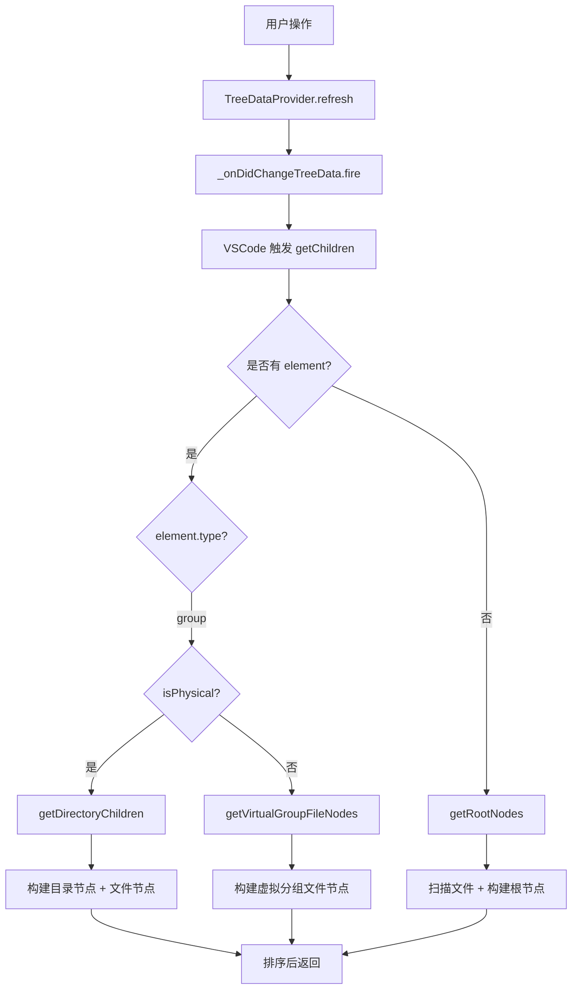
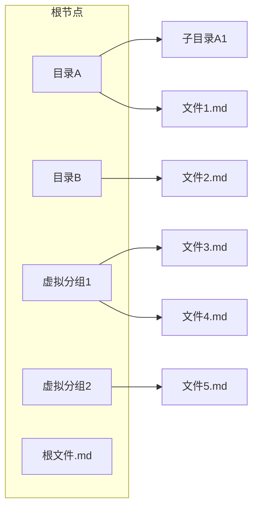

# 树视图与分组

<cite>
**本文档引用的文件**
- [markdownTreeProvider.ts](../../../src/markdownTreeProvider.ts)
- [groupManager.ts](../../../src/groupManager.ts)
- [types.ts](../../../src/types.ts)
</cite>

## 目录
1. [概述](#概述)
2. [节点模型与类型](#节点模型与类型)
3. [树视图数据流程](#树视图数据流程)
4. [物理分组与虚拟分组](#物理分组与虚拟分组)
5. [分组管理器](#分组管理器)
6. [文件扫描与排除](#文件扫描与排除)

## 概述

树视图是 RepoWiki 的核心 UI 组件，负责以层级结构展示工作区中的 Markdown 文件。系统支持两种分组方式：

- **物理分组**：基于文件系统目录结构自动生成
- **虚拟分组**：用户自定义的文件集合，可跨目录组织文件

树视图通过 `MarkdownTreeProvider` 类实现 VSCode 的 `TreeDataProvider` 接口。

**Section sources**
- [markdownTreeProvider.ts](../../../src/markdownTreeProvider.ts#L1-L18)

## 节点模型与类型

树视图使用统一的 `TreeNodeData` 接口描述所有节点：

```typescript
interface TreeNodeData {
  type: TreeItemType;        // 'group' | 'file'
  label: string;             // 显示名称
  filePath?: string;         // 文件节点：绝对路径
  relativePath?: string;     // 文件节点：相对路径
  groupName?: string;        // 分组节点：分组名称
  isPhysical?: boolean;      // 分组节点：是否为物理分组
  directoryPath?: string;    // 物理分组：目录路径
}
```

节点类型分为两类：

| 类型 | 说明 | contextValue | 图标 |
|------|------|--------------|------|
| `group` (物理) | 文件系统目录 | `physicalGroup` | `folder` |
| `group` (虚拟) | 用户自定义分组 | `virtualGroup` | `folder-library` |
| `file` | Markdown 文件 | `file` | `markdown` |

**Section sources**
- [types.ts](../../../src/types.ts#L3-L45)

## 树视图数据流程

树视图通过事件驱动的刷新机制更新显示：



核心方法职责：

| 方法 | 职责 |
|------|------|
| `refresh()` | 触发整树刷新 |
| `getTreeItem()` | 将 `TreeNodeData` 转换为 VSCode `TreeItem` |
| `getChildren()` | 获取子节点列表 |
| `getRootNodes()` | 获取根级目录 + 虚拟分组 + 根文件 |
| `getDirectoryChildren()` | 获取物理目录下的子项 |
| `getVirtualGroupFileNodes()` | 获取虚拟分组下的文件 |

**Section sources**
- [markdownTreeProvider.ts](../../../src/markdownTreeProvider.ts#L20-L92)
- [markdownTreeProvider.ts](../../../src/markdownTreeProvider.ts#L119-L148)

**Diagram sources**
- [markdownTreeProvider.ts](../../../src/markdownTreeProvider.ts#L1-L228)

## 物理分组与虚拟分组

### 物理分组

物理分组基于工作区目录结构自动生成，特点：

- 根据文件实际所在目录创建层级结构
- 支持目录别名（通过 `directoryAliases` 配置）
- 自动排除空目录
- 节点按字母顺序排序

### 虚拟分组

虚拟分组是用户自定义的文件集合，特点：

- 可跨目录组织文件
- 存储在工作区配置 `repowiki.groups` 中
- 一个文件只能属于一个虚拟分组
- 默认分组"未分类"不可删除或重命名



**Section sources**
- [markdownTreeProvider.ts](../../../src/markdownTreeProvider.ts#L150-L175)
- [markdownTreeProvider.ts](../../../src/markdownTreeProvider.ts#L197-L213)

**Diagram sources**
- [markdownTreeProvider.ts](../../../src/markdownTreeProvider.ts#L119-L228)

## 分组管理器

`GroupManager` 负责处理分组相关的业务逻辑：

```typescript
class GroupManager {
  // 获取所有虚拟分组配置
  getGroups(): GroupConfig

  // 获取目录别名配置
  getDirectoryAliases(): DirectoryAliasConfig

  // 设置目录别名
  async setDirectoryAlias(directoryPath: string, alias: string): Promise<boolean>

  // 获取目录的显示名称
  getDirectoryDisplayName(directoryPath: string): string

  // 获取文件所属分组（优先虚拟分组，再物理目录）
  getFileGroup(relativePath: string): { groupName: string; isPhysical: boolean }

  // 创建新虚拟分组
  async createGroup(name: string): Promise<boolean>

  // 删除虚拟分组
  async deleteGroup(name: string): Promise<boolean>

  // 重命名虚拟分组
  async renameGroup(oldName: string, newName: string): Promise<boolean>

  // 移动文件到虚拟分组
  async moveFileToGroup(relativePath: string, groupName: string): Promise<boolean>

  // 获取所有虚拟分组名
  getAllVirtualGroupNames(): string[]
}
```

### 文件分组判定逻辑

文件归属判定优先级：

1. 先检查是否在虚拟分组配置中
2. 若不在虚拟分组，则归属到物理目录

**Section sources**
- [groupManager.ts](../../../src/groupManager.ts#L11-L179)

## 文件扫描与排除

系统通过 `scanMarkdownFiles()` 方法扫描工作区：

```typescript
const excludePatterns = config.get<string[]>('excludePatterns') || [];
const exclude = excludePatterns.length > 0
  ? `{${excludePatterns.join(',')}}`
  : undefined;
const uris = await vscode.workspace.findFiles('**/*.md', exclude);
```

扫描过程：

1. 读取 `repowiki.excludePatterns` 配置
2. 将排除模式转换为 glob 格式
3. 使用 `workspace.findFiles()` 扫描 `**/*.md`
4. 为每个文件计算相对路径和目录信息
5. 通过 `GroupManager.getFileGroup()` 确定文件归属

扫描结果被缓存用于构建树视图节点。

> **注意**：排除模式使用 VSCode glob 语法，支持 `**`、`*`、`?` 等通配符。

**Section sources**
- [markdownTreeProvider.ts](../../../src/markdownTreeProvider.ts#L215-L247)

---

## 更新记录

| 日期 | 内容 | 作者 |
|------|------|------|
| 2026-01-16 | 根据最新代码重构文档，更新相对路径引用 | - |
