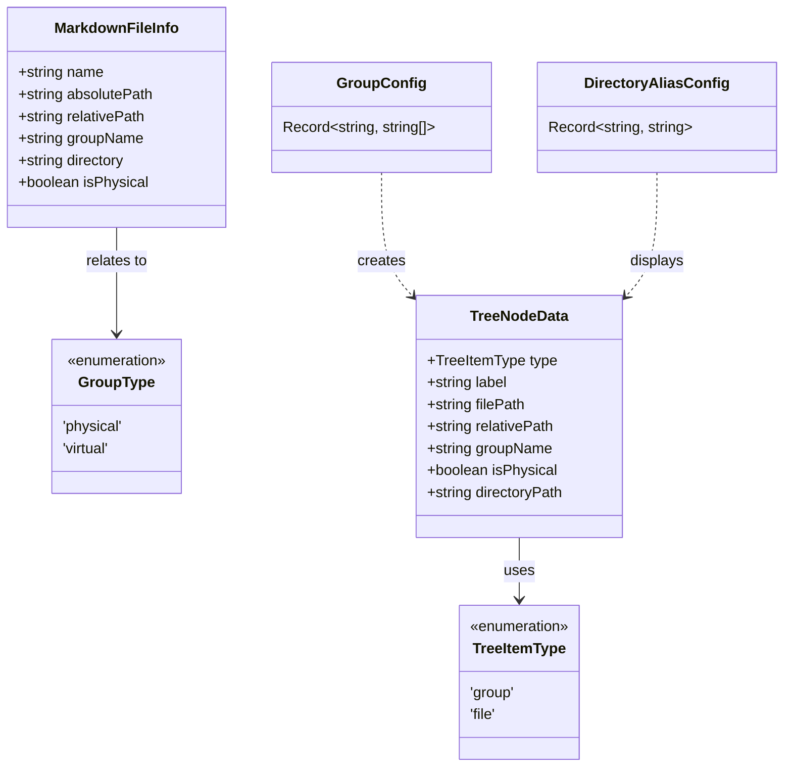

```markdown
# 类型定义

<cite source="../src/types.ts"></cite>

本文档详细说明 RepoWiki 扩展的核心类型定义，这些类型构成了整个系统的数据结构基础。

## 目录

- [目录](#目录)
- [概述](#概述)
- [基础类型](#基础类型)
- [配置类型](#配置类型)
- [数据接口](#数据接口)
- [类型关系图](#类型关系图)

## 概述

`src/types.ts` 文件定义了 RepoWiki 扩展使用的所有 TypeScript 类型和接口。这些类型主要用于：

- TreeView 节点的数据表示
- 分组配置的存储和解析
- Markdown 文件信息的封装

**Section sources:** `src/types.ts:1-47`

## 基础类型

### TreeItemType

TreeView 节点的枚举类型，标识节点是分组还是文件。

```typescript
export type TreeItemType = 'group' | 'file';
```

**Section sources:** `src/types.ts:4`

### GroupType

分组类型枚举，区分物理分组和虚拟分组。

```typescript
export type GroupType = 'physical' | 'virtual';
```

- **`physical`**: 物理分组，基于实际文件系统目录结构
- **`virtual`**: 虚拟分组，用户自定义的文件集合

**Section sources:** `src/types.ts:7`

## 配置类型

### GroupConfig

虚拟分组配置类型，定义分组名与文件路径列表的映射关系。

```typescript
export type GroupConfig = Record<string, string[]>;
```

**使用示例：**

```typescript
const groups: GroupConfig = {
  '核心功能': ['src/agentManager.ts', 'src/docGenerator.ts'],
  '文档': ['docs/*.md']
};
```

**Section sources:** `src/types.ts:10`

### DirectoryAliasConfig

目录别名配置类型，用于为目录路径设置友好的显示名称。

```typescript
export type DirectoryAliasConfig = Record<string, string>;
```

**使用示例：**

```typescript
const aliases: DirectoryAliasConfig = {
  'src/agent': 'Agent 管理',
  'src/core': '核心模块'
};
```

**Section sources:** `src/types.ts:13`

## 数据接口

### TreeNodeData

TreeView 节点的数据接口，用于在侧边栏树视图中表示分组和文件节点。

```typescript
export interface TreeNodeData {
  type: TreeItemType;
  label: string;
  /** 文件节点的绝对路径 */
  filePath?: string;
  /** 文件节点的相对路径（用于配置存储） */
  relativePath?: string;
  /** 分组节点名称 */
  groupName?: string;
  /** 是否为物理分组（基于目录） */
  isPhysical?: boolean;
  /** 物理分组的原始目录路径 */
  directoryPath?: string;
}
```

**字段说明：**

| 字段 | 类型 | 必填 | 说明 |
|------|------|------|------|
| `type` | `TreeItemType` | 是 | 节点类型：分组或文件 |
| `label` | `string` | 是 | 显示标签 |
| `filePath` | `string` | 否 | 文件节点的绝对路径 |
| `relativePath` | `string` | 否 | 相对于工作区的路径 |
| `groupName` | `string` | 否 | 所属分组名称 |
| `isPhysical` | `boolean` | 否 | 是否为物理分组 |
| `directoryPath` | `string` | 否 | 物理分组的原始目录路径 |

**Section sources:** `src/types.ts:16-27`

### MarkdownFileInfo

Markdown 文件的完整信息接口，封装了文件在系统中的各种路径和属性。

```typescript
export interface MarkdownFileInfo {
  /** 文件名（不含路径） */
  name: string;
  /** 绝对路径 */
  absolutePath: string;
  /** 相对于工作区的路径 */
  relativePath: string;
  /** 所属分组名 */
  groupName: string;
  /** 所在目录（相对路径） */
  directory: string;
  /** 是否属于物理分组 */
  isPhysical: boolean;
}
```

**字段说明：**

| 字段 | 类型 | 说明 |
|------|------|------|
| `name` | `string` | 文件名，不含路径 |
| `absolutePath` | `string` | 文件系统中的绝对路径 |
| `relativePath` | `string` | 相对于工作区根目录的路径 |
| `groupName` | `string` | 文件所属的分组名称 |
| `directory` | `string` | 文件所在目录的相对路径 |
| `isPhysical` | `boolean` | 是否来自物理分组 |

**Section sources:** `src/types.ts:30-41`

## 类型关系图

以下是核心类型之间的关系结构：

