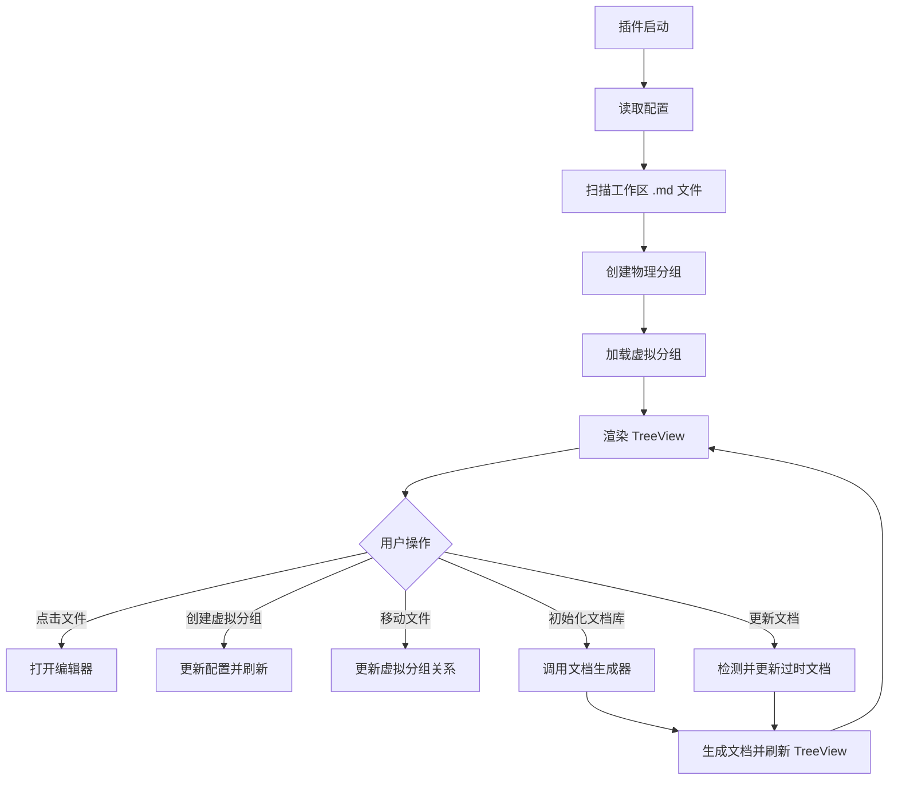

# 系统概述

<cite>源代码文件: [README.md](../README.md)</cite>

## 目录

- [功能特性](#功能特性)
- [安装方式](#安装方式)
- [使用说明](#使用说明)
- [项目结构](#项目结构)
- [配置项](#配置项)
- [系统流程](#系统流程)

## 功能特性

RepoWiki 是一个 VSCode 插件，用于在资源管理器侧边栏中管理和浏览工作区的 Markdown 文档，并支持智能文档生成。

### Markdown 文档管理

| 功能 | 说明 |
|------|------|
| **自动扫描** | 自动扫描工作区中的所有 `.md` 文档 |
| **物理分组** | 按实际目录结构自动创建分组，只显示包含 `.md` 文件的目录 |
| **虚拟分组** | 支持创建虚拟分组，跨目录聚合文档 |
| **目录别名** | 支持为物理目录设置显示别名（不影响文件系统） |
| **实时监听** | 实时监听文件变化，自动更新列表 |
| **快速打开** | 点击文件名直接在编辑器中打开 |

### 智能文档生成

| 功能 | 说明 |
|------|------|
| **初始化文档库** | 一键生成完整的项目文档库（基于 skill-repo-wiki 规则） |
| **智能更新** | 根据文件修改时间自动检测：缺失文档生成、过时文档更新、最新文档跳过 |
| **强制重新生成** | 清空并重新生成所有文档 |
| **进度显示** | 实时显示生成进度和结果统计 |
| **错误处理** | 详细的错误日志和失败处理 |

**Section sources:** [README.md:4-36](../README.md#L4-L36)

## 安装方式

### 方式一：从 VSIX 安装

1. 构建 VSIX 包：
   ```bash
   npm install
   npm run build
   npx vsce package
   ```

2. 在 VSCode 中安装：
   - 打开 VSCode
   - 按 `Ctrl+Shift+P` (macOS: `Cmd+Shift+P`)
   - 输入 `Extensions: Install from VSIX...`
   - 选择生成的 `.vsix` 文件

### 方式二：开发模式调试

```bash
git clone <repository-url>
cd vscode-repowiki
npm install
```

在 VSCode 中打开项目，按 `F5` 启动调试。

**Section sources:** [README.md:38-55](../README.md#L38-L55)

## 使用说明

### 基本操作

1. **查看文档列表**：安装后，侧边栏会出现「RepoWiki」图标，点击即可查看工作区所有 Markdown 文档
2. **打开文档**：点击列表中的文件名，文档会在主编辑器区域打开
3. **刷新列表**：点击视图标题栏的刷新按钮

### 物理分组（目录）

物理分组基于工作区实际目录结构自动生成：

- **查看物理分组**：首次启动时自动按目录创建分组，图标为文件夹图标
- **设置目录别名**：
  1. 右键点击物理分组
  2. 选择「设置目录别名」
  3. 输入别名（留空则清除别名）
  4. 别名仅在插件界面显示，不影响文件系统

### 虚拟分组

虚拟分组由用户手动创建，可以跨目录聚合文档：

- **创建虚拟分组**：点击视图标题栏的「新建文件夹」图标，输入虚拟分组名称
- **移动文件到虚拟分组**：右键点击文件 → 选择「移动到虚拟分组」→ 选择目标虚拟分组
- **重命名虚拟分组**：右键点击虚拟分组 → 选择「重命名虚拟分组」
- **删除虚拟分组**：点击虚拟分组右侧的删除图标，确认删除（文件会回到物理目录分组）

### 文档生成功能

#### 初始化文档库

首次使用时，点击视图标题栏的「初始化文档库」按钮：

1. 自动创建 `repowiki/` 目录结构
2. 根据预设的映射关系生成所有文档
3. 显示生成进度和结果

#### 更新文档

点击「更新文档」按钮：

1. 自动检测所有代码文件的修改时间
2. 对比文档修改时间：代码比文档新→更新、文档不存在→生成、文档最新→跳过
3. 显示更新统计

#### 强制重新生成

右键点击视图标题 → 选择「强制重新生成所有文档」：

1. 删除现有所有文档
2. 重新生成完整文档库
3. 此操作不可撤销 ⚠️

#### 文档生成日志

所有文档生成操作都会在「RepoWiki 文档生成」输出面板中记录详细日志。打开方式：`查看 → 输出 → RepoWiki 文档生成`。

**Section sources:** [README.md:57-133](../README.md#L57-L133)

## 项目结构

```
src/
├── extension.ts           # 插件入口
├── markdownTreeProvider.ts # TreeView 数据提供者
├── groupManager.ts        # 分组管理器（物理+虚拟）
├── fileWatcher.ts         # 文件监听器
├── types.ts               # 类型定义
├── docGenerator.ts        # 文档生成器（调用 Agent）
├── docStatusChecker.ts    # 文档状态检测器
├── docMappingConfig.ts    # 文档映射配置
└── docTypes.ts            # 文档生成类型定义
```

**Section sources:** [README.md:157-167](../README.md#L157-L167)

## 配置项

在 VSCode 设置中可配置：

| 配置项 | 说明 | 默认值 |
|--------|------|--------|
| `repowiki.groups` | 虚拟分组配置 | `{}` |
| `repowiki.directoryAliases` | 目录别名配置 | `{}` |
| `repowiki.initialized` | 插件是否已初始化 | `false` |
| `repowiki.docMappings` | 代码文件与文档的映射关系 | `[]`（使用默认映射） |
| `repowiki.excludePatterns` | 排除的文件匹配模式 | `["**/node_modules/**", "**/.git/**"]` |

### 自定义文档映射

在 `.vscode/settings.json` 中配置：

```json
{
  "repowiki.docMappings": [
    {
      "sourcePath": "src/myModule.ts",
      "docPath": "zh/content/核心功能模块/我的模块.md",
      "title": "我的模块"
    }
  ]
}
```

**Section sources:** [README.md:135-155](../README.md#L135-L155)

## 系统流程



**Section sources:** 系统流程图基于 [README.md](../README.md) 中描述的功能特性综合整理