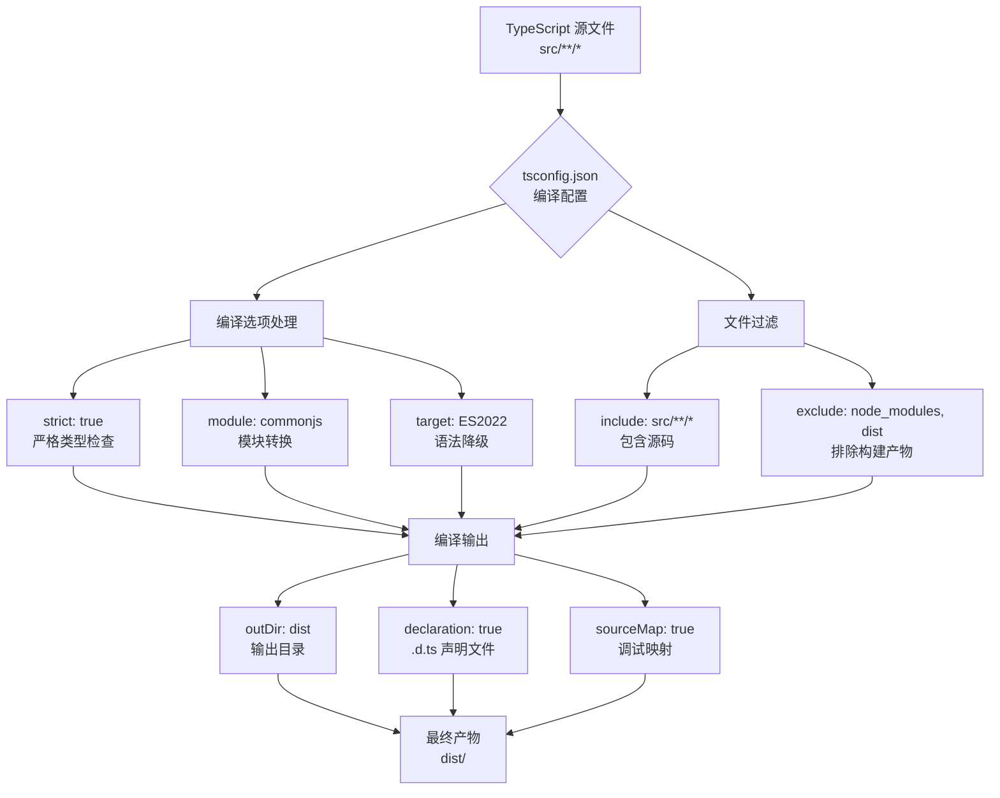

```markdown
# TypeScript 配置

<cite>源代码文件：[tsconfig.json](../../../tsconfig.json)</cite>

本文档详细说明项目的 TypeScript 编译配置，包括编译选项、模块解析策略和构建输出设置。

<!-- TOC -->

## 目录

- [概述](#概述)
- [编译选项详解](#编译选项详解)
- [文件包含与排除](#文件包含与排除)
- [模块解析](#模块解析)
- [类型检查策略](#类型检查策略)
- [构建输出](#构建输出)
- [配置流程图](#配置流程图)

## 概述

`tsconfig.json` 是 TypeScript 项目的核心配置文件，定义了编译器如何处理源代码。当前配置采用严格模式，确保代码质量和类型安全。

## 编译选项详解

### 基础编译设置

| 选项 | 值 | 说明 |
|------|-----|------|
| `module` | `"commonjs"` | 指定模块代码生成方式，使用 CommonJS 规范 |
| `target` | `"ES2022"` | 编译目标 ECMAScript 版本 |
| `lib` | `["ES2022"]` | 包含的内置类型定义库 |

**Section sources:** `tsconfig.json:3-5`

### 严格模式与类型检查

| 选项 | 值 | 说明 |
|------|-----|------|
| `strict` | `true` | 启用所有严格类型检查选项 |
| `forceConsistentCasingInFileNames` | `true` | 强制文件名大小写一致性 |
| `skipLibCheck` | `true` | 跳过库文件的类型检查，提升编译速度 |

**Section sources:** `tsconfig.json:8,11,13`

### 模块与互操作性

| 选项 | 值 | 说明 |
|------|-----|------|
| `esModuleInterop` | `true` | 允许使用 ES6 风格导入 CommonJS 模块 |
| `resolveJsonModule` | `true` | 允许导入 `.json` 文件 |

**Section sources:** `tsconfig.json:12,14`

## 文件包含与排除

### 包含规则

```json
"include": ["src/**/*"]
```

包含 `src` 目录下的所有 TypeScript 文件（包括子目录）。

**Section sources:** `tsconfig.json:18`

### 排除规则

```json
"exclude": ["node_modules", "dist"]
```

排除以下目录：
- `node_modules` - 第三方依赖包
- `dist` - 编译输出目录

**Section sources:** `tsconfig.json:19`

## 模块解析

项目的模块解析配置如下：

```typescript
// CommonJS 模块导出
module.exports = { 
  someFunction: () => {} 
};

// 可通过 ES6 风格导入（得益于 esModuleInterop）
import { someFunction } from './module';
```

**Section sources:** `tsconfig.json:3,12`

## 类型检查策略

### 严格模式启用

启用 `strict: true` 后，以下所有选项自动开启：

| 子选项 | 效果 |
|--------|------|
| `noImplicitAny` | 禁止隐式 `any` 类型 |
| `strictNullChecks` | 严格空值检查 |
| `strictFunctionTypes` | 严格函数类型检查 |
| `strictBindCallApply` | 严格 bind/call/apply 检查 |
| `strictPropertyInitialization` | 严格属性初始化检查 |
| `noImplicitThis` | 禁止隐式 `this` 类型 |
| `alwaysStrict` | 始终使用严格模式解析 |

**Section sources:** `tsconfig.json:8`

## 构建输出

### 输出目录配置

| 选项 | 值 | 说明 |
|------|-----|------|
| `outDir` | `"dist"` | 编译输出目录 |
| `rootDir` | `"src"` | 源代码根目录 |

**Section sources:** `tsconfig.json:6-7`

### 调试支持

| 选项 | 值 | 说明 |
|------|-----|------|
| `declaration` | `true` | 生成 `.d.ts` 类型声明文件 |
| `declarationMap` | `true` | 生成声明文件的 source map |
| `sourceMap` | `true` | 生成 `.js.map` 源码映射文件 |

**Section sources:** `tsconfig.json:15-17`

### 输出结构

```
项目根目录/
├── src/              # 源代码
│   └── *.ts         # TypeScript 源文件
└── dist/            # 编译输出
    ├── *.js         # 编译后的 JavaScript
    ├── *.d.ts       # 类型声明文件
    ├── *.js.map     # JavaScript 源码映射
    └── *.d.ts.map   # 声明文件源码映射
```

**Section sources:** `tsconfig.json:6-7,15-17`

## 配置流程图



**Section sources:** `tsconfig.json:3-19`
```