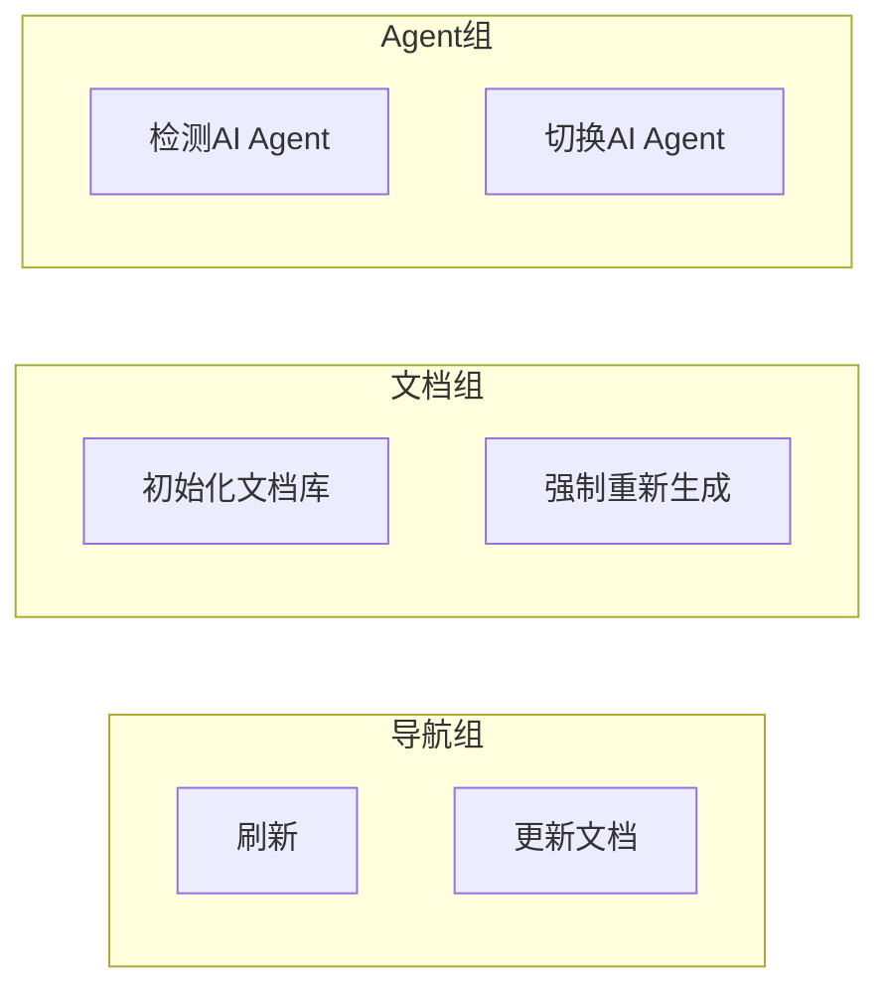

# Package.json 配置

<cite>
**本文档引用的文件**
- [package.json](../../package.json)
</cite>

## 目录
1. [概述](#概述)
2. [基础信息](#基础信息)
3. [VS Code 扩展配置](#vs-code-扩展配置)
4. [贡献点（Contributes）](#贡献点contributes)
5. [脚本命令](#脚本命令)
6. [开发依赖](#开发依赖)

## 概述

`package.json` 是 VS Code 扩展的核心配置文件，定义了插件的基本信息、激活方式、UI 贡献点、命令、配置项和构建脚本等。

**Section sources**
- [package.json](../../package.json#L1-L92)

## 基础信息

### 字段说明

| 字段 | 值 | 说明 |
|------|-----|------|
| `name` | `vscode-repowiki` | 扩展内部标识名 |
| `displayName` | `RepoWiki` | 扩展显示名称 |
| `description` | 在资源管理器侧边栏中管理和浏览工作区的 Markdown 文档 | 扩展描述 |
| `version` | `0.0.1` | 当前版本号 |
| `publisher` | `repowiki` | 发布者标识 |
| `categories` | `["Other"]` | 扩展分类 |

**Section sources**
- [package.json](../../package.json#L1-L11)

### 引擎要求

```json
"engines": {
  "vscode": "^1.85.0"
}
```

插件需要 VS Code 版本 1.85.0 或更高。

**Section sources**
- [package.json](../../package.json#L12-L14)

## VS Code 扩展配置

### 激活事件

```json
"activationEvents": [
  "onStartupFinished"
]
```

插件在 VS Code 启动完成后激活，避免影响启动性能。

**Section sources**
- [package.json](../../package.json#L15-L17)

### 入口文件

```json
"main": "./dist/extension.js"
```

编译后的扩展入口文件位于 `dist` 目录。

**Section sources**
- [package.json](../../package.json#L18)

## 贡献点（Contributes）

### 视图容器

在活动栏中添加 RepoWiki 容器：

```json
"viewsContainers": {
  "activitybar": [
    {
      "id": "repowiki-container",
      "title": "RepoWiki",
      "icon": "$(book)"
    }
  ]
}
```

**Section sources**
- [package.json](../../package.json#L20-L28)

### 视图

在容器中添加 Markdown 文档树视图：

```json
"views": {
  "repowiki-container": [
    {
      "id": "repowiki.markdownExplorer",
      "name": "Markdown 文档",
      "icon": "$(markdown)",
      "contextualTitle": "RepoWiki"
    }
  ]
}
```

**Section sources**
- [package.json](../../package.json#L29-L38)

### 命令

| 命令 ID | 标题 | 图标 | 说明 |
|---------|------|------|------|
| `repowiki.refresh` | 刷新文档列表 | `refresh` | 刷新树视图 |
| `repowiki.detectAgents` | 检测 AI Agent | `search` | 检测可用的 AI Agent |
| `repowiki.switchAgent` | 切换 AI Agent | `arrow-swap` | 切换当前使用的 Agent |
| `repowiki.initDocs` | 初始化文档库 | `file-add` | 初始化文档结构 |
| `repowiki.updateDocs` | 更新文档 | `sync` | 增量更新文档 |
| `repowiki.regenerateDocs` | 强制重新生成所有文档 | `debug-restart` | 完全重新生成 |
| `repowiki.deleteGroup` | 删除虚拟分组 | `trash` | 删除选中的虚拟分组 |
| `repowiki.renameGroup` | 重命名虚拟分组 | - | 重命名分组 |
| `repowiki.setAlias` | 设置目录别名 | - | 为目录设置显示别名 |
| `repowiki.openFile` | 打开文件 | - | 在编辑器中打开文件 |

**Section sources**
- [package.json](../../package.json#L39-L83)

### 菜单

#### 视图标题菜单



**Diagram sources**
- [package.json](../../package.json#L84-L117)

#### 右键菜单

| 命令 | 显示条件 |
|------|----------|
| `repowiki.deleteGroup` | `viewItem == virtualGroup` |
| `repowiki.renameGroup` | `viewItem == virtualGroup` |
| `repowiki.setAlias` | `viewItem == physicalGroup` |

**Section sources**
- [package.json](../../package.json#L118-L133)

### 配置项

#### 虚拟分组配置

```json
"repowiki.groups": {
  "type": "object",
  "default": {},
  "description": "虚拟分组配置，键为分组名，值为文件路径数组"
}
```

**Section sources**
- [package.json](../../package.json#L138-L142)

#### 目录别名配置

```json
"repowiki.directoryAliases": {
  "type": "object",
  "default": {},
  "description": "目录别名配置，键为目录路径，值为显示别名"
}
```

**Section sources**
- [package.json](../../package.json#L143-L147)

#### 文档映射配置

```json
"repowiki.docMappings": {
  "type": "array",
  "default": [],
  "description": "代码文件与文档的映射关系配置"
}
```

**Section sources**
- [package.json](../../package.json#L154-L158)

#### AI Agent 配置

| 配置项 | 类型 | 默认值 | 说明 |
|--------|------|--------|------|
| `repowiki.preferredAgent` | enum | - | 首选 Agent 类型 |
| `repowiki.customAgentCommand` | string | - | 自定义命令名称 |
| `repowiki.customAgentTemplate` | string | - | 命令模板 |
| `repowiki.customAgentPriority` | number | 100 | 自定义 Agent 优先级 |

**Section sources**
- [package.json](../../package.json#L159-L178)

#### 排除模式

```json
"repowiki.excludePatterns": {
  "type": "array",
  "default": [
    "**/node_modules/**",
    "**/.git/**"
  ],
  "description": "排除的文件匹配模式"
}
```

**Section sources**
- [package.json](../../package.json#L179-L185)

## 脚本命令

```json
"scripts": {
  "vscode:prepublish": "npm run build",
  "build": "node esbuild.js --production",
  "watch": "node esbuild.js --watch",
  "lint": "eslint src --ext ts",
  "typecheck": "tsc --noEmit"
}
```

| 命令 | 说明 |
|------|------|
| `vscode:prepublish` | 发布前构建 |
| `build` | 生产环境构建 |
| `watch` | 监听模式构建 |
| `lint` | ESLint 代码检查 |
| `typecheck` | TypeScript 类型检查 |

**Section sources**
- [package.json](../../package.json#L187-L193)

## 开发依赖

```json
"devDependencies": {
  "@types/node": "^20.10.0",
  "@types/vscode": "^1.85.0",
  "@typescript-eslint/eslint-plugin": "^6.13.0",
  "@typescript-eslint/parser": "^6.13.0",
  "esbuild": "^0.19.8",
  "eslint": "^8.54.0",
  "typescript": "^5.3.0"
}
```

| 依赖 | 用途 |
|------|------|
| `@types/node` | Node.js 类型定义 |
| `@types/vscode` | VS Code API 类型定义 |
| `@typescript-eslint/*` | TypeScript ESLint 规则 |
| `esbuild` | 快速打包工具 |
| `eslint` | 代码检查工具 |
| `typescript` | TypeScript 编译器 |

**Section sources**
- [package.json](../../package.json#L195-L203)

---

## 更新记录

| 日期 | 内容 | 作者 |
|------|------|------|
| 2026-01-16 | 根据 package.json 创建完整配置文档 | - |
