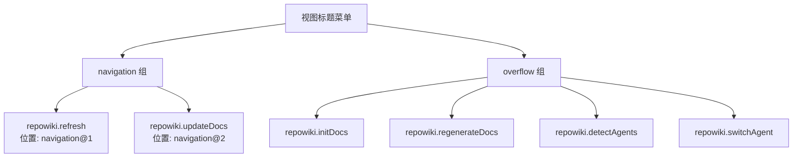

# Package.json 配置

<cite>源代码文件：[`../../package.json`](../../package.json)</cite>

## 目录

- [概述](#概述)
- [基础信息](#基础信息)
- [激活事件](#激活事件)
- [贡献点](#贡献点)
- [脚本命令](#脚本命令)
- [开发依赖](#开发依赖)

## 概述

`package.json` 是 VSCode 扩展的配置清单文件，定义了扩展的元数据、激活条件、贡献点（Contribution Points）、配置属性和构建脚本等信息。

**Section sources:** [`../../package.json`](../../package.json:1)

## 基础信息

```json
{
  "name": "vscode-repowiki",
  "displayName": "RepoWiki",
  "description": "在资源管理器侧边栏中管理和浏览工作区的 Markdown 文档",
  "version": "0.0.1",
  "publisher": "repowiki",
  "engines": {
    "vscode": "^1.85.0"
  },
  "categories": ["Other"]
}
```

| 字段 | 值 | 说明 |
|------|-----|------|
| `name` | `vscode-repowiki` | 扩展的唯一标识符 |
| `displayName` | `RepoWiki` | 扩展在市场上的显示名称 |
| `description` | 在资源管理器侧边栏中管理和浏览工作区的 Markdown 文档 | 扩展功能描述 |
| `version` | `0.0.1` | 当前版本号 |
| `publisher` | `repowiki` | 发布者标识 |
| `engines.vscode` | `^1.85.0` | 最低支持的 VSCode 版本 |
| `categories` | `["Other"]` | 扩展所属分类 |

**Section sources:** [`../../package.json`](../../package.json:2-14)

## 激活事件

```json
"activationEvents": ["onStartupFinished"]
```

扩展使用 `onStartupFinished` 激活事件，意味着：
- VSCode 启动完成后激活扩展
- 避免阻塞启动过程，提升用户体验

**Section sources:** [`../../package.json`](../../package.json:15-17)

## 贡献点

### 视图容器

扩展在活动栏（Activity Bar）中注册了一个自定义容器：

```json
"viewsContainers": {
  "activitybar": [
    {
      "id": "repowiki-container",
      "title": "RepoWiki",
      "icon": "$(book)"
    }
  ]
}
```

**Section sources:** [`../../package.json`](../../package.json:19-27)

### 视图

在 `repowiki-container` 容器中注册了 Markdown 文档浏览视图：

```json
"views": {
  "repowiki-container": [
    {
      "id": "repowiki.markdownExplorer",
      "name": "Markdown 文档",
      "icon": "$(markdown)",
      "contextualTitle": "RepoWiki"
    }
  ]
}
```

**Section sources:** [`../../package.json`](../../package.json:28-38)

### 命令

扩展注册了以下命令：

| 命令 ID | 标题 | 图标 | 功能 |
|---------|------|------|------|
| `repowiki.refresh` | 刷新文档列表 | `$(refresh)` | 刷新文档树视图 |
| `repowiki.detectAgents` | 检测 AI Agent | - | 检测可用的 AI Agent |
| `repowiki.switchAgent` | 切换 AI Agent | - | 切换当前使用的 AI Agent |
| `repowiki.initDocs` | 初始化文档库 | - | 初始化文档系统 |
| `repowiki.updateDocs` | 更新文档 | `$(sync)` | 增量更新文档 |
| `repowiki.regenerateDocs` | 强制重新生成所有文档 | - | 完全重新生成文档 |
| `repowiki.deleteGroup` | 删除虚拟分组 | `$(trash)` | 删除指定的虚拟分组 |
| `repowiki.renameGroup` | 重命名虚拟分组 | - | 重命名虚拟分组 |
| `repowiki.setAlias` | 设置目录别名 | - | 为物理目录设置别名 |
| `repowiki.openFile` | 打开文件 | - | 打开选中的文件 |

**Section sources:** [`../../package.json`](../../package.json:40-77)

### 菜单

#### 视图标题菜单

命令在视图工具栏中的位置安排：



**Section sources:** [`../../package.json`](../../package.json:79-107)

#### 视图项上下文菜单

根据节点类型显示不同的上下文菜单项：

| 节点类型 | 可用命令 |
|----------|----------|
| `virtualGroup`（虚拟分组） | 删除虚拟分组、重命名虚拟分组 |
| `physicalGroup`（物理分组） | 设置目录别名 |

```json
"view/item/context": [
  {
    "command": "repowiki.deleteGroup",
    "when": "view == repowiki.markdownExplorer && viewItem == virtualGroup",
    "group": "inline"
  },
  {
    "command": "repowiki.renameGroup",
    "when": "view == repowiki.markdownExplorer && viewItem == virtualGroup"
  },
  {
    "command": "repowiki.setAlias",
    "when": "view == repowiki.markdownExplorer && viewItem == physicalGroup"
  }
]
```

**Section sources:** [`../../package.json`](../../package.json:108-123)

### 配置属性

扩展提供了以下配置项供用户自定义：

#### 分组配置

```json
"repowiki.groups": {
  "type": "object",
  "default": {},
  "description": "虚拟分组配置，键为分组名，值为文件路径数组"
}
```

**Section sources:** [`../../package.json`](../../package.json:128-132)

#### 目录别名

```json
"repowiki.directoryAliases": {
  "type": "object",
  "default": {},
  "description": "目录别名配置，键为目录路径，值为显示别名"
}
```

**Section sources:** [`../../package.json`](../../package.json:133-137)

#### 初始化状态

```json
"repowiki.initialized": {
  "type": "boolean",
  "default": false,
  "description": "插件是否已初始化"
}
```

**Section sources:** [`../../package.json`](../../package.json:138-142)

#### 文档映射

```json
"repowiki.docMappings": {
  "type": "array",
  "default": [],
  "description": "代码文件与文档的映射关系配置"
}
```

**Section sources:** [`../../package.json`](../../package.json:143-147)

#### AI Agent 配置

| 配置项 | 类型 | 默认值 | 说明 |
|--------|------|--------|------|
| `repowiki.preferredAgent` | enum | - | 首选的 AI Agent 类型：`qoder`、`claude`、`codex`、`cursor`、`aider`、`custom` |
| `repowiki.customAgentCommand` | string | - | 自定义 AI Agent 命令名称 |
| `repowiki.customAgentTemplate` | string | - | 自定义 AI Agent 命令模板（支持占位符：`{{PROMPT}}`、`{{DOC_PATH}}`、`{{TITLE}}`、`{{SOURCE_FILES}}`） |
| `repowiki.customAgentPriority` | number | `100` | 自定义 AI Agent 的优先级 |

**Section sources:** [`../../package.json`](../../package.json:148-165)

#### 排除模式

```json
"repowiki.excludePatterns": {
  "type": "array",
  "default": ["**/node_modules/**", "**/.git/**"],
  "description": "排除的文件匹配模式"
}
```

**Section sources:** [`../../package.json`](../../package.json:166-171)

#### 日志配置

```json
"repowiki.enableLogging": {
  "type": "boolean",
  "default": false,
  "description": "启用 RepoWiki 插件的详细日志输出,用于调试和问题排查"
}
```

**Section sources:** [`../../package.json`](../../package.json:172-177)

## 脚本命令

| 命令 | 功能 |
|------|------|
| `vscode:prepublish` | 发布前构建，调用 `build` 命令 |
| `build` | 生产环境构建，执行 `node esbuild.js --production` |
| `watch` | 监听模式构建，自动检测文件变化并重新编译 |
| `lint` | 代码检查，使用 ESLint 检查 `src` 目录下的 TypeScript 文件 |
| `typecheck` | 类型检查，执行 TypeScript 编译器检查但不生成输出文件 |

**Section sources:** [`../../package.json`](../../package.json:179-186)

## 开发依赖

| 依赖包 | 版本 | 用途 |
|--------|------|------|
| `@types/node` | `^20.10.0` | Node.js 类型定义 |
| `@types/vscode` | `^1.85.0` | VSCode API 类型定义 |
| `@typescript-eslint/eslint-plugin` | `^6.13.0` | TypeScript ESLint 插件 |
| `@typescript-eslint/parser` | `^6.13.0` | TypeScript ESLint 解析器 |
| `esbuild` | `^0.19.8` | 快速的 JavaScript 打包工具 |
| `eslint` | `^8.54.0` | JavaScript/TypeScript 代码检查工具 |
| `typescript` | `^5.3.0` | TypeScript 编译器 |

**Section sources:** [`../../package.json`](../../package.json:188-196)