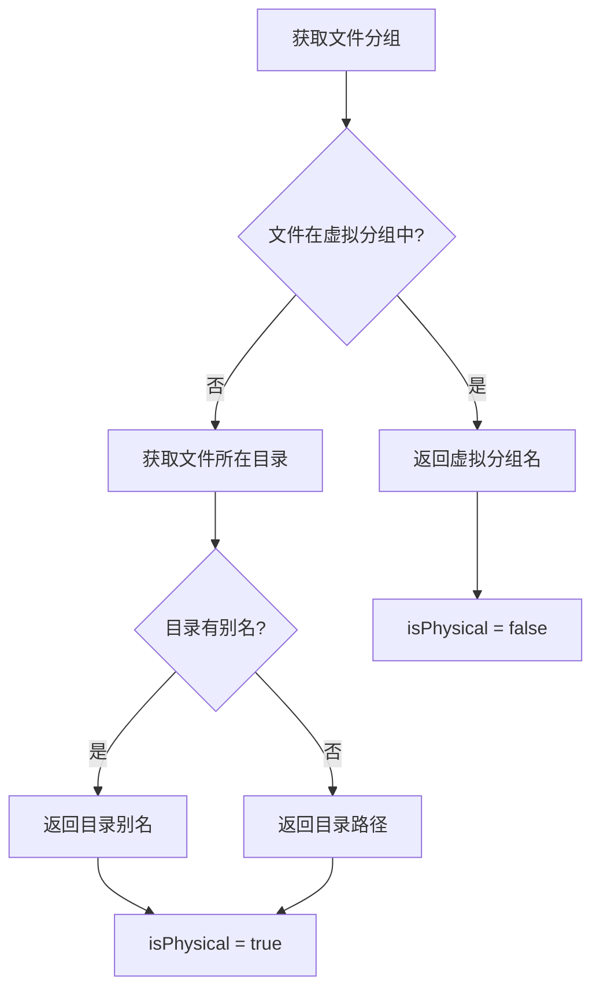

# 分组管理

<cite>
**本文档引用的文件**
- [groupManager.ts](file://src/groupManager.ts)
- [types.ts](file://src/types.ts)
</cite>

## 目录
1. [概述](#概述)
2. [核心概念](#核心概念)
3. [虚拟分组管理](#虚拟分组管理)
4. [目录别名系统](#目录别名系统)
5. [文件分组逻辑](#文件分组逻辑)
6. [API 参考](#api-参考)
7. [配置存储](#配置存储)

---

## 概述

`GroupManager` 是 RepoWiki 扩展中负责管理文件分组的核心类。它支持两种分组方式：

- **虚拟分组**：用户自定义的文件集合，文件可跨越物理目录边界
- **物理分组**：基于文件系统目录结构的自动分组

通过这两种分组机制，用户可以灵活地组织和管理项目中的 Markdown 文件。

**Section sources**
- [groupManager.ts](file://src/groupManager.ts#L1-L30)

---

## 核心概念

### 分组类型

| 类型 | 说明 | 存储位置 |
|------|------|----------|
| 虚拟分组 | 用户创建的文件集合，可包含任意位置的文件 | VS Code 工作区配置 |
| 物理分组 | 基于文件系统目录自动生成 | 文件系统 |

### 默认分组

系统定义了 `DEFAULT_GROUP = '未分类'` 作为默认分组名称。未被加入任何虚拟分组的文件将自动归入其物理目录分组。

**Section sources**
- [groupManager.ts](file://src/groupManager.ts#L6-L8)
- [types.ts](file://src/types.ts#L6-L13)

---

## 虚拟分组管理

### 创建分组

```typescript
async createGroup(name: string): Promise<boolean>
```

创建新的虚拟分组。如果分组名无效或已存在，将返回 `false`。

- **限制**：不能使用 "未分类" 作为分组名
- **重复检查**：同名分组会被拒绝

**Section sources**
- [groupManager.ts](file://src/groupManager.ts#L105-L119)

### 删除分组

```typescript
async deleteGroup(name: string): Promise<boolean>
```

删除指定的虚拟分组。删除后，原分组内的文件将自动移至其物理目录分组。

- **限制**：无法删除默认分组 "未分类"

**Section sources**
- [groupManager.ts](file://src/groupManager.ts#L121-L133)

### 重命名分组

```typescript
async renameGroup(oldName: string, newName: string): Promise<boolean>
```

重命名现有虚拟分组。

- **限制**：不能重命名默认分组 "未分类"
- **冲突检查**：目标名称已存在时操作失败

**Section sources**
- [groupManager.ts](file://src/groupManager.ts#L135-L149)

### 移动文件到分组

```typescript
async moveFileToGroup(relativePath: string, groupName: string): Promise<boolean>
```

将文件移动到指定的虚拟分组。操作会先将文件从所有现有虚拟分组中移除，再添加到目标分组。

**Section sources**
- [groupManager.ts](file://src/groupManager.ts#L163-L179)

---

## 目录别名系统

目录别名允许用户为物理目录指定自定义显示名称，使分组显示更加友好。

### 设置别名

```typescript
async setDirectoryAlias(directoryPath: string, alias: string): Promise<boolean>
```

为指定目录设置显示别名。

**Section sources**
- [groupManager.ts](file://src/groupManager.ts#L30-L37)

### 获取显示名称

```typescript
getDirectoryDisplayName(directoryPath: string): string
```

获取目录的显示名称，优先返回别名，否则返回原始路径。根目录显示为 "根目录"。

**Section sources**
- [groupManager.ts](file://src/groupManager.ts#L39-L43)

---

## 文件分组逻辑

### 获取文件所属分组

```typescript
getFileGroup(relativePath: string): { groupName: string; isPhysical: boolean }
```

确定文件的归属分组，遵循以下优先级：



**Section sources**
- [groupManager.ts](file://src/groupManager.ts#L62-L76)

### 获取所有物理分组

```typescript
async getPhysicalGroups(files: Array<{ relativePath: string }>): Promise<Map<string, string>>
```

从文件列表中提取所有唯一的物理目录，返回目录路径到显示名称的映射。

**Section sources**
- [groupManager.ts](file://src/groupManager.ts#L78-L92)

---

## API 参考

### 配置获取

| 方法 | 返回类型 | 说明 |
|------|----------|------|
| `getGroups()` | `GroupConfig` | 获取所有虚拟分组配置 |
| `getDirectoryAliases()` | `DirectoryAliasConfig` | 获取所有目录别名配置 |
| `getAllVirtualGroupNames()` | `string[]` | 获取所有虚拟分组名称 |

### 初始化状态

| 方法 | 返回类型 | 说明 |
|------|----------|------|
| `isInitialized()` | `boolean` | 检查是否已初始化 |
| `markInitialized()` | `Promise<void>` | 标记为已初始化 |

**Section sources**
- [groupManager.ts](file://src/groupManager.ts#L19-L43)
- [groupManager.ts](file://src/groupManager.ts#L185-L187)

---

## 配置存储

所有配置通过 VS Code 的 `ConfigurationTarget.Workspace` 存储到工作区设置中。

### 配置键

| 键 | 类型 | 说明 |
|---|------|------|
| `repowiki.groups` | `GroupConfig` | 虚拟分组配置 |
| `repowiki.directoryAliases` | `DirectoryAliasConfig` | 目录别名配置 |
| `repowiki.initialized` | `boolean` | 初始化标志 |

### 配置结构示例

```json
{
  "repowiki.groups": {
    "文档": [
      "docs/guide.md",
      "docs/api.md"
    ],
    "组件": [
      "src/Button.tsx",
      "src/Input.tsx"
    ]
  },
  "repowiki.directoryAliases": {
    "docs": "文档目录",
    "src/components": "组件库"
  },
  "repowiki.initialized": true
}
```

**Section sources**
- [groupManager.ts](file://src/groupManager.ts#L190-L193)
