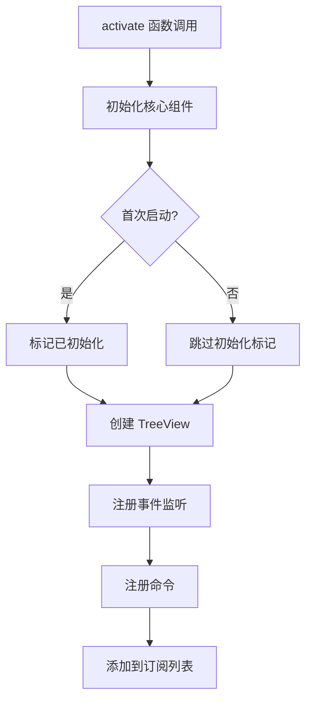
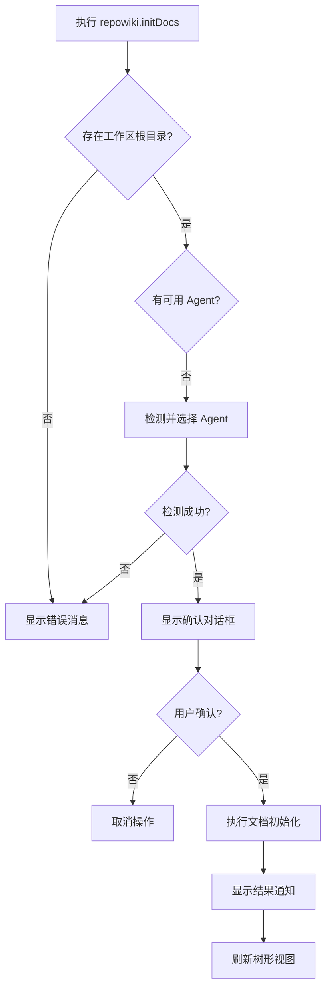

# 插件入口与命令

<cite>
**本文档引用的文件**
- [extension.ts](../../src/extension.ts)
- [markdownTreeProvider.ts](../../src/markdownTreeProvider.ts)
- [groupManager.ts](../../src/groupManager.ts)
- [docGenerator.ts](../../src/docGenerator.ts)
- [agentManager.ts](../../src/agentManager.ts)
</cite>

## 目录
1. [概述](#概述)
2. [激活流程](#激活流程)
3. [核心组件初始化](#核心组件初始化)
4. [命令列表](#命令列表)
5. [事件监听](#事件监听)
6. [资源管理](#资源管理)

## 概述

`extension.ts` 是 VSCode 插件的入口文件，负责在插件激活时初始化所有核心组件、注册命令和事件监听器。插件通过 `activate` 函数完成初始化，通过 `deactivate` 函数进行清理。

**Section sources**
- [extension.ts](../../src/extension.ts#L10-L397)

## 激活流程

插件激活时的完整流程如下：



**Diagram sources**
- [extension.ts](../../src/extension.ts#L10-L47)

## 核心组件初始化

### 组件列表

| 组件 | 类名 | 职责 |
|------|------|------|
| 树形视图提供者 | `MarkdownTreeProvider` | 提供 Markdown 文件的树形结构数据 |
| 文件监视器 | `FileWatcher` | 监视文件系统变化 |
| 分组管理器 | `GroupManager` | 管理虚拟分组和目录别名 |
| AI Agent 管理器 | `AgentManager` | 管理可用的 AI Agent |
| 文档生成器 | `DocGenerator` | 负责文档的生成和更新 |

### 初始化代码

```typescript
export function activate(context: vscode.ExtensionContext) {
  const treeProvider = new MarkdownTreeProvider(context);
  const fileWatcher = new FileWatcher();
  const groupManager = treeProvider.getGroupManager();

  // AI Agent 管理器
  const agentManager = new AgentManager();

  // 文档生成器
  const workspaceRoot = vscode.workspace.workspaceFolders?.[0]?.uri.fsPath;
  const docGenerator = workspaceRoot
    ? new DocGenerator(workspaceRoot, context.extensionPath, agentManager)
    : undefined;
```

**Section sources**
- [extension.ts](../../src/extension.ts#L11-L22)

### 首次启动处理

插件首次启动时会进行初始化标记：

```typescript
if (!groupManager.isInitialized()) {
  groupManager.markInitialized().then(() => {
    treeProvider.refresh();
  });
}
```

**Section sources**
- [extension.ts](../../src/extension.ts#L24-L29)

## 命令列表

插件注册了以下命令供用户调用：

### 基础命令

| 命令 ID | 功能 | 参数 |
|---------|------|------|
| `repowiki.refresh` | 刷新树形视图 | 无 |
| `repowiki.openFile` | 打开指定文件 | `filePath: string` |

### 分组管理命令

| 命令 ID | 功能 | 参数 | 限制 |
|---------|------|------|------|
| `repowiki.deleteGroup` | 删除虚拟分组 | `node: TreeNodeData` | 物理分组不可删除 |
| `repowiki.renameGroup` | 重命名虚拟分组 | `node: TreeNodeData` | 物理分组不可重命名 |
| `repowiki.setAlias` | 设置目录别名 | `node: TreeNodeData` | 仅物理目录可设置 |

#### 删除虚拟分组

```typescript
vscode.commands.registerCommand('repowiki.deleteGroup', async (node: TreeNodeData) => {
  if (!node?.groupName) return;

  // 物理分组不可删除
  if (node.isPhysical) {
    vscode.window.showWarningMessage('物理目录分组不可删除，只能设置别名');
    return;
  }

  const confirm = await vscode.window.showWarningMessage(
    `确定删除虚拟分组 "${node.groupName}"？该分组下的文件将回到物理目录分组。`,
    '确定',
    '取消'
  );

  if (confirm === '确定') {
    const success = await groupManager.deleteGroup(node.groupName);
    if (success) treeProvider.refresh();
  }
})
```

**Section sources**
- [extension.ts](../../src/extension.ts#L72-L97)

### AI Agent 命令

| 命令 ID | 功能 | 说明 |
|---------|------|------|
| `repowiki.detectAgents` | 检测可用的 AI Agent | 自动选择最佳 Agent |
| `repowiki.switchAgent` | 切换当前使用的 AI Agent | 通过快速选择面板 |

#### 检测 AI Agent

```typescript
vscode.commands.registerCommand('repowiki.detectAgents', async () => {
  agentManager.show();

  await vscode.window.withProgress({
    location: vscode.ProgressLocation.Notification,
    title: '检测可用的 AI Agent',
    cancellable: false,
  }, async () => {
    const configs = await agentManager.detectAvailableAgents();
    const available = configs.filter((c) => c.available);

    if (available.length === 0) {
      vscode.window.showErrorMessage('未检测到任何可用的 AI Agent');
    } else {
      await agentManager.selectBestAgent();
      vscode.window.showInformationMessage(
        `检测到 ${available.length} 个可用的 AI Agent，当前使用: ${agentManager.getActiveAgent()?.name}`
      );
    }
  });
})
```

**Section sources**
- [extension.ts](../../src/extension.ts#L156-L182)

### 文档生成命令

| 命令 ID | 功能 | 说明 |
|---------|------|------|
| `repowiki.initDocs` | 初始化文档库 | 首次生成所有文档 |
| `repowiki.updateDocs` | 更新文档 | 仅更新有变更的文档 |
| `repowiki.regenerateDocs` | 强制重新生成 | 删除现有文档后重新生成 |

#### 初始化文档库流程



**Diagram sources**
- [extension.ts](../../src/extension.ts#L220-L278)

#### 更新文档

```typescript
vscode.commands.registerCommand('repowiki.updateDocs', async () => {
  if (!docGenerator) {
    vscode.window.showErrorMessage('未找到工作区根目录');
    return;
  }

  if (!agentManager.getActiveAgent()) {
    await agentManager.detectAvailableAgents();
    await agentManager.selectBestAgent();

    if (!agentManager.getActiveAgent()) {
      vscode.window.showErrorMessage('未找到可用的 AI Agent');
      return;
    }
  }

  docGenerator.show();

  await vscode.window.withProgress({
    location: vscode.ProgressLocation.Notification,
    title: '更新文档',
    cancellable: false,
  }, async (progress) => {
    try {
      const result = await docGenerator.updateDocs(progress);

      if (result.success === 0 && result.skipped > 0) {
        vscode.window.showInformationMessage('所有文档都是最新的');
      } else if (result.failed > 0) {
        vscode.window.showWarningMessage(
          `文档更新完成：成功 ${result.success}，失败 ${result.failed}，跳过 ${result.skipped}`
        );
      } else {
        vscode.window.showInformationMessage(
          `文档更新完成：更新 ${result.success} 个文档，跳过 ${result.skipped} 个`
        );
      }

      treeProvider.refresh();
    } catch (error: any) {
      vscode.window.showErrorMessage(`更新失败: ${error.message}`);
    }
  });
})
```

**Section sources**
- [extension.ts](../../src/extension.ts#L280-L329)

## 事件监听

插件监听以下事件以保持视图与数据同步：

### 文件变化事件

```typescript
fileWatcher.onDidChange(() => treeProvider.refresh());
```

当文件系统发生变化时，自动刷新树形视图。

**Section sources**
- [extension.ts](../../src/extension.ts#L37-L38)

### 配置变化事件

```typescript
vscode.workspace.onDidChangeConfiguration((e) => {
  if (e.affectsConfiguration('repowiki')) {
    treeProvider.refresh();
  }
})
```

当插件配置发生变化时，自动刷新树形视图。

**Section sources**
- [extension.ts](../../src/extension.ts#L40-L47)

## 资源管理

### 订阅管理

所有命令注册和事件监听器都被添加到 `context.subscriptions` 中，确保插件停用时能正确释放资源：

```typescript
context.subscriptions.push(
  // 配置变化监听
  vscode.workspace.onDidChangeConfiguration((e) => { ... }),

  // 命令注册
  vscode.commands.registerCommand('repowiki.refresh', ...),
  vscode.commands.registerCommand('repowiki.openFile', ...),
  // ... 更多命令
);

// 组件资源
context.subscriptions.push(treeView, fileWatcher, agentManager);
if (docGenerator) {
  context.subscriptions.push(docGenerator);
}
```

**Section sources**
- [extension.ts](../../src/extension.ts#L390-L395)

### 停用处理

```typescript
export function deactivate() {}
```

由于所有资源都已通过 `context.subscriptions` 管理，VSCode 会在插件停用时自动清理这些资源，因此 `deactivate` 函数无需额外操作。

**Section sources**
- [extension.ts](../../src/extension.ts#L397)

---

## 更新记录

| 日期 | 内容 | 作者 |
|------|------|------|
| 2026-01-16 | 初始版本，基于 extension.ts 创建 | - |
