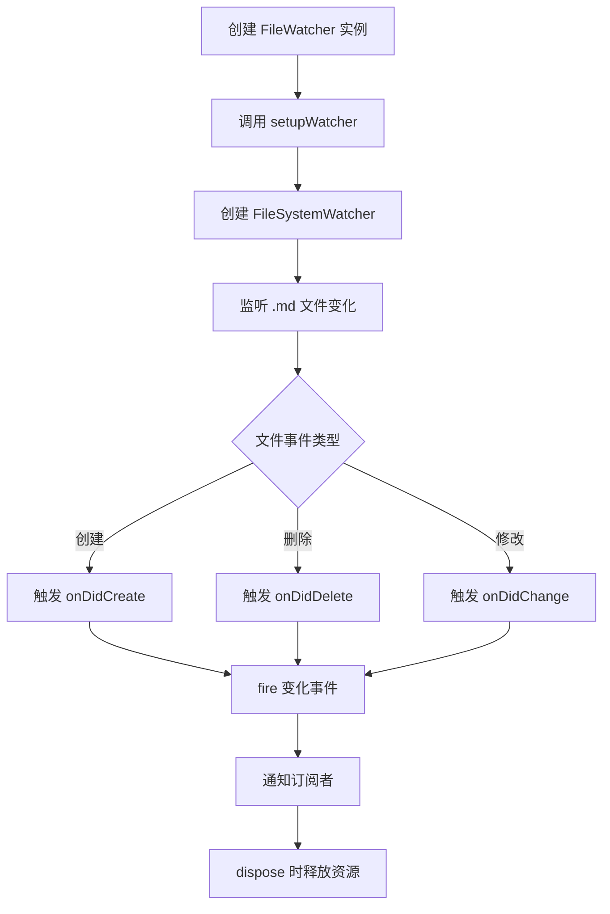

# 文件监听

<cite>源代码：[../../src/fileWatcher.ts](../../src/fileWatcher.ts)</cite>

## 目录

- [概述](#概述)
- [类设计](#类设计)
- [工作流程](#工作流程)
- [API 参考](#api-参考)

## 概述

`FileWatcher` 类负责监听工作区中 Markdown 文件的变化，并通过事件机制通知订阅者。当文件被创建、删除或修改时，会触发相应的事件。

**Section sources:** [src/fileWatcher.ts](../../src/fileWatcher.ts#L1-L24)

## 类设计

### FileWatcher

实现 `vscode.Disposable` 接口，确保资源能够正确释放。

```typescript
export class FileWatcher implements vscode.Disposable
```

#### 属性

| 属性 | 类型 | 描述 |
|------|------|------|
| `watcher` | `vscode.FileSystemWatcher \| undefined` | VS Code 文件系统监听器实例 |
| `onChangeEmitter` | `vscode.EventEmitter<void>` | 事件发射器，用于触发文件变化事件 |
| `onDidChange` | `Event<void>` | 公开的事件，供外部订阅文件变化 |

**Section sources:** [src/fileWatcher.ts](../../src/fileWatcher.ts#L1-L11)

#### 构造函数

创建 `FileWatcher` 实例并自动设置监听器。

```typescript
constructor()
```

**Section sources:** [src/fileWatcher.ts](../../src/fileWatcher.ts#L13-L15)

#### 方法

##### setupWatcher()

初始化文件系统监听器，监听所有 `.md` 文件的变化。

```typescript
private setupWatcher(): void
```

- 监听模式：`**/*.md`（所有 Markdown 文件）
- 触发事件：创建、删除、修改

**Section sources:** [src/fileWatcher.ts](../../src/fileWatcher.ts#L17-L23)

##### dispose()

释放监听器和事件发射器资源。

```typescript
dispose(): void
```

**Section sources:** [src/fileWatcher.ts](../../src/fileWatcher.ts#L25-L29)

## 工作流程



**Section sources:** [src/fileWatcher.ts](../../src/fileWatcher.ts#L17-L24)

## API 参考

### 使用示例

```typescript
import { FileWatcher } from './fileWatcher';

// 创建文件监听器
const watcher = new FileWatcher();

// 订阅文件变化事件
const disposable = watcher.onDidChange(() => {
  console.log('检测到文件变化');
});

// 使用完毕后释放资源
disposable.dispose();
watcher.dispose();
```

**Section sources:** [src/fileWatcher.ts](../../src/fileWatcher.ts#L1-L29)
