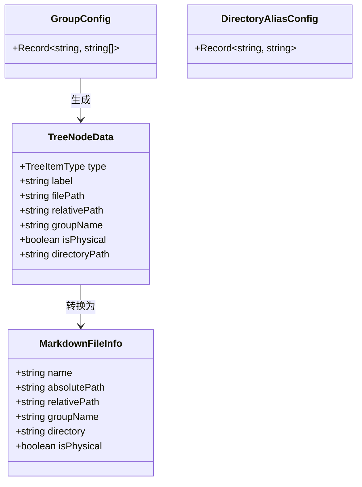

# 类型定义

<cite>源代码文件: file://src/types.ts</cite>

本文档描述 RepoWiki 扩展的核心类型定义，包括树视图节点类型、分组类型、配置接口和数据结构。

## 目录

- [树视图节点类型](#树视图节点类型)
- [分组类型](#分组类型)
- [配置接口](#配置接口)
- [数据结构](#数据结构)

## 树视图节点类型

`TreeItemType` 定义了树视图中节点的两种基本类型：

| 类型值 | 说明 |
|--------|------|
| `group` | 分组节点，用于组织文件 |
| `file` | 文件节点，表示具体的 Markdown 文件 |

**Section sources:** file://src/types.ts:4

## 分组类型

`GroupType` 定义了两种分组方式：

| 类型值 | 说明 |
|--------|------|
| `physical` | 物理分组，基于文件系统目录结构 |
| `virtual` | 虚拟分组，用户自定义的文件集合 |

**Section sources:** file://src/types.ts:7

## 配置接口

### 虚拟分组配置

`GroupConfig` 用于存储虚拟分组定义，将分组名映射到文件路径数组：

```typescript
export type GroupConfig = Record<string, string[]>;
```

**示例：**

```typescript
const config: GroupConfig = {
  "前端开发": ["docs/react.md", "docs/vue.md"],
  "后端开发": ["docs/node.md", "docs/python.md"]
};
```

**Section sources:** file://src/types.ts:10

### 目录别名配置

`DirectoryAliasConfig` 用于定义目录路径的显示别名：

```typescript
export type DirectoryAliasConfig = Record<string, string>;
```

**示例：**

```typescript
const aliases: DirectoryAliasConfig = {
  "docs/api": "API 文档",
  "docs/guides": "使用指南"
};
```

**Section sources:** file://src/types.ts:13

## 数据结构

### TreeNodeData

`TreeNodeData` 接口定义了树视图节点的完整数据结构：

```typescript
export interface TreeNodeData {
  type: TreeItemType;
  label: string;
  filePath?: string;
  relativePath?: string;
  groupName?: string;
  isPhysical?: boolean;
  directoryPath?: string;
}
```

| 属性 | 类型 | 说明 |
|------|------|------|
| `type` | `TreeItemType` | 节点类型（分组或文件） |
| `label` | `string` | 显示标签 |
| `filePath` | `string` (可选) | 文件节点的绝对路径 |
| `relativePath` | `string` (可选) | 文件节点的相对路径（用于配置存储） |
| `groupName` | `string` (可选) | 所属分组名称 |
| `isPhysical` | `boolean` (可选) | 是否为物理分组 |
| `directoryPath` | `string` (可选) | 物理分组的原始目录路径 |

**Section sources:** file://src/types.ts:16-28

### MarkdownFileInfo

`MarkdownFileInfo` 接口描述了 Markdown 文件的完整元数据：

```typescript
export interface MarkdownFileInfo {
  name: string;
  absolutePath: string;
  relativePath: string;
  groupName: string;
  directory: string;
  isPhysical: boolean;
}
```

| 属性 | 类型 | 说明 |
|------|------|------|
| `name` | `string` | 文件名（不含路径） |
| `absolutePath` | `string` | 文件的绝对路径 |
| `relativePath` | `string` | 相对于工作区的路径 |
| `groupName` | `string` | 所属分组名 |
| `directory` | `string` | 所在目录（相对路径） |
| `isPhysical` | `boolean` | 是否属于物理分组 |

**数据关系图：**



**Section sources:** file://src/types.ts:31-44
