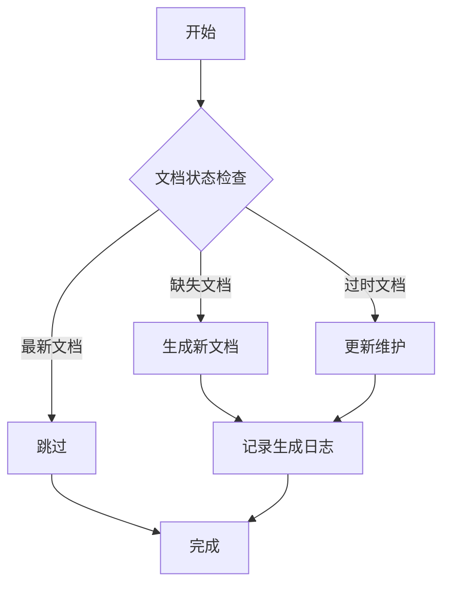
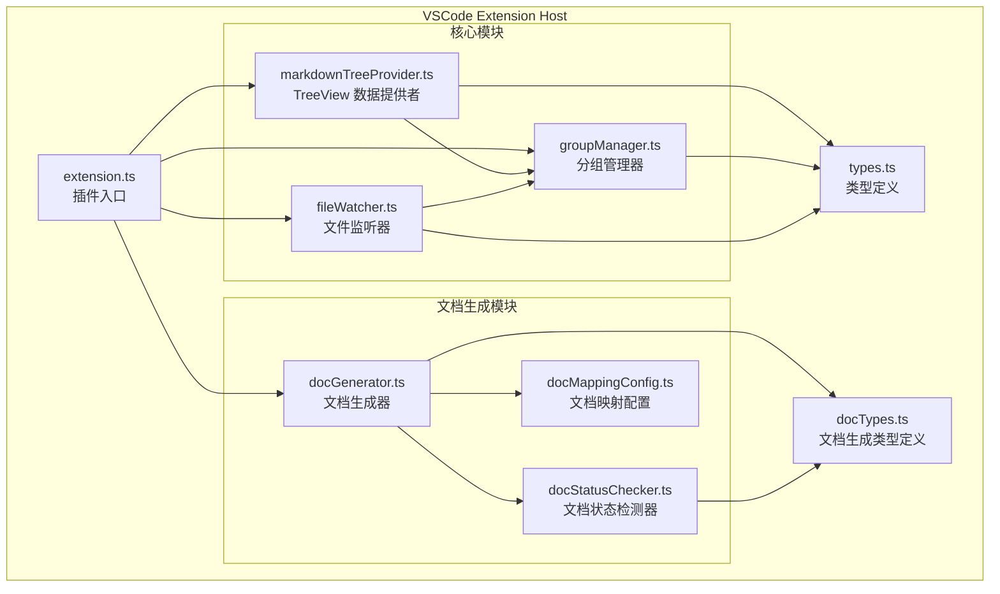

# RepoWiki 系统概述

<cite>
**本文档引用的文件**
- [README.md](file://README.md)
- [package.json](file://package.json)
- [src/extension.ts](file://src/extension.ts)
</cite>

## 目录
1. [简介](#简介)
2. [核心功能](#核心功能)
3. [系统架构](#系统架构)
4. [技术栈](#技术栈)
5. [项目结构](#项目结构)
6. [配置说明](#配置说明)

---

## 简介

RepoWiki 是一个 VSCode 插件，用于在资源管理器侧边栏中管理和浏览工作区的 Markdown 文档，并支持智能文档生成。

**核心价值：**
- 提供可视化的 Markdown 文档管理界面
- 支持物理分组和虚拟分组两种文档组织方式
- 集成智能文档生成能力，自动维护项目文档库

**Section sources**
- [README.md](file://README.md#L1-L4)

---

## 核心功能

### Markdown 文档管理

| 功能 | 说明 |
|------|------|
| **自动扫描** | 自动扫描工作区中的所有 `.md` 文档 |
| **物理分组** | 首次启动时，按照实际目录结构自动创建分组 |
| **虚拟分组** | 支持创建虚拟分组，跨目录聚合文档 |
| **目录别名** | 支持为物理目录设置显示别名（不影响文件系统） |
| **实时监听** | 实时监听文件变化，自动更新列表 |
| **快速打开** | 点击文件名直接在编辑器中打开 |

**Section sources**
- [README.md](file://README.md#L7-L14)

### 智能文档生成

智能文档生成功能基于 skill-repo-wiki 规则，提供完整的文档生命周期管理：



| 功能 | 说明 |
|------|------|
| **初始化文档库** | 一键生成完整的项目文档库 |
| **智能更新** | 根据文件修改时间自动检测并更新 |
| **强制重新生成** | 清空并重新生成所有文档 |
| **进度显示** | 实时显示生成进度和结果统计 |
| **错误处理** | 详细的错误日志和失败处理 |

**Section sources**
- [README.md](file://README.md#L16-L26)

---

## 系统架构



**Diagram sources**
- [README.md](file://README.md#L184-L195)

---

## 技术栈

### 运行时环境

| 依赖项 | 版本要求 | 说明 |
|--------|----------|------|
| **Node.js** | >= 16.x | JavaScript 运行时 |
| **VSCode** | >= 1.85.0 | VSCode API 版本 |
| **Qoder CLI** | - | 用于文档生成（需要在 PATH 中可用） |

**Section sources**
- [README.md](file://README.md#L197-L201)

### 开发工具链

```bash
# 安装依赖
npm install

# 开发模式（监听文件变化）
npm run watch

# 类型检查
npm run typecheck

# 生产构建
npm run build

# 代码检查
npm run lint
```

**Section sources**
- [README.md](file://README.md#L163-L180)

---

## 项目结构

```
src/
├── extension.ts           # 插件入口
├── markdownTreeProvider.ts # TreeView 数据提供者
├── groupManager.ts        # 分组管理器（物理+虚拟）
├── fileWatcher.ts         # 文件监听器
├── types.ts               # 类型定义
├── docGenerator.ts        # 文档生成器（调用 Agent）
├── docStatusChecker.ts    # 文档状态检测器
├── docMappingConfig.ts    # 文档映射配置
└── docTypes.ts            # 文档生成类型定义
```

**模块说明：**

| 文件 | 职责 |
|------|------|
| `extension.ts` | VSCode 插件入口，注册命令和视图 |
| `markdownTreeProvider.ts` | 提供 TreeView 数据结构 |
| `groupManager.ts` | 管理物理分组和虚拟分组 |
| `fileWatcher.ts` | 监听文件系统变化 |
| `docGenerator.ts` | 调用 Agent 生成文档 |
| `docStatusChecker.ts` | 检测文档与代码的同步状态 |
| `docMappingConfig.ts` | 管理代码与文档的映射关系 |
| `types.ts` / `docTypes.ts` | TypeScript 类型定义 |

**Section sources**
- [README.md](file://README.md#L182-L195)

---

## 配置说明

### VSCode 配置项

| 配置项 | 说明 | 默认值 |
|--------|------|--------|
| `repowiki.groups` | 虚拟分组配置 | `{}` |
| `repowiki.directoryAliases` | 目录别名配置 | `{}` |
| `repowiki.initialized` | 插件是否已初始化 | `false` |
| `repowiki.docMappings` | 代码文件与文档的映射关系 | `[]`（使用默认映射） |
| `repowiki.excludePatterns` | 排除的文件匹配模式 | `["**/node_modules/**", "**/.git/**"]` |

**Section sources**
- [README.md](file://README.md#L137-L145)

### 自定义文档映射

在 `.vscode/settings.json` 中配置代码与文档的映射关系：

```json
{
  "repowiki.docMappings": [
    {
      "sourcePath": "src/myModule.ts",
      "docPath": "zh/content/核心功能模块/我的模块.md",
      "title": "我的模块"
    }
  ]
}
```

**Section sources**
- [README.md](file://README.md#L147-L161)

---

## 更新记录

| 日期 | 内容 | 作者 |
|------|------|------|
| 2026-01-15 | 初始版本，基于 README.md 创建系统概述文档 | - |
