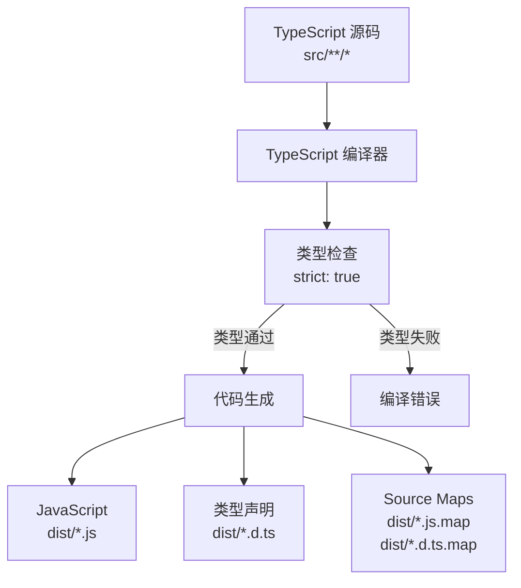

# TypeScript 配置

> 本文档说明项目的 TypeScript 编译器配置及其用途。

## 目录

1. [概述](#概述)
2. [编译选项](#编译选项)
3. [包含与排除](#包含与排除)
4. [配置原理](#配置原理)

## 概述

TypeScript 配置文件定义了项目的编译行为。本配置采用严格模式，生成完整的类型声明文件和源码映射，便于开发调试和库的使用者获得完整的类型提示。

**Section sources**
- [tsconfig.json](file://../../tsconfig.json)

## 编译选项

### 模块与目标

| 选项 | 值 | 说明 |
|------|-----|------|
| `module` | `commonjs` | 输出模块系统为 CommonJS |
| `target` | `ES2022` | 编译目标为 ECMAScript 2022 |
| `lib` | `["ES2022"]` | 包含的 ES2022 标准库类型定义 |

**Section sources**
- [tsconfig.json](file://../../tsconfig.json#L3-L5)

### 输出配置

| 选项 | 值 | 说明 |
|------|-----|------|
| `outDir` | `dist` | 输出目录 |
| `rootDir` | `src` | 源代码根目录 |
| `declaration` | `true` | 生成 `.d.ts` 类型声明文件 |
| `declarationMap` | `true` | 生成声明文件的源码映射 |
| `sourceMap` | `true` | 生成 `.js.map` 源码映射文件 |

**Section sources**
- [tsconfig.json](file://../../tsconfig.json#L6-L13)

### 类型检查

| 选项 | 值 | 说明 |
|------|-----|------|
| `strict` | `true` | 启用所有严格类型检查选项 |
| `forceConsistentCasingInFileNames` | `true` | 强制文件名大小写一致 |

**Section sources**
- [tsconfig.json](file://../../tsconfig.json#L9-L10)

### 模块解析

| 选项 | 值 | 说明 |
|------|-----|------|
| `esModuleInterop` | `true` | 允许导入 CommonJS 模块作为 ES 模块 |
| `resolveJsonModule` | `true` | 允许导入 `.json` 文件 |
| `skipLibCheck` | `true` | 跳过库文件的类型检查 |

**Section sources**
- [tsconfig.json](file://../../tsconfig.json#L8-L11)

## 包含与排除

- **include**: `src/**/*` — 包含 `src` 目录下所有文件
- **exclude**: `node_modules`, `dist` — 排除依赖和输出目录

**Section sources**
- [tsconfig.json](file://../../tsconfig.json#L16-L17)

## 配置原理

**Diagram sources**
- [tsconfig.json](file://../../tsconfig.json)
